# MISC解题writeup

## 签到

- 没什么特别的

  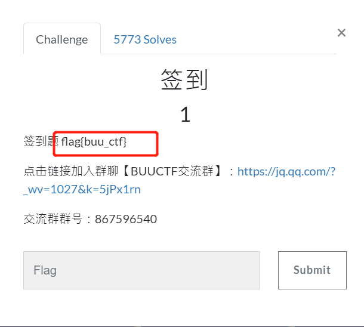


## [二维码](https://buuoj.cn/challenges#%E4%BA%8C%E7%BB%B4%E7%A0%81)

- 题目是一个压缩包，解压后是一个二维码`QR_code.png`，没发现什么异常

- 使用`binwalk`提取`QR_code.png`，提出了一个`4number.txt`，貌似暗示了该文件密码是4位数

  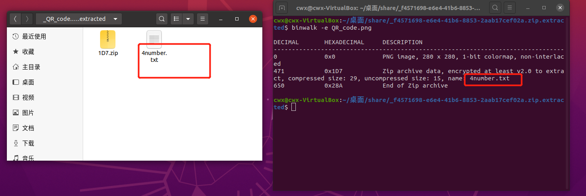

  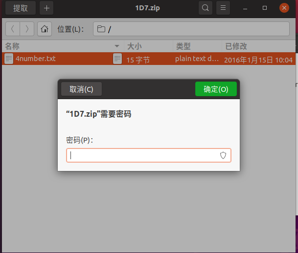

- 使用`fcrackzip`暴力破解密码

  ```bash
fcrackzip -b -c1 -l 4 -u
  ```
  
  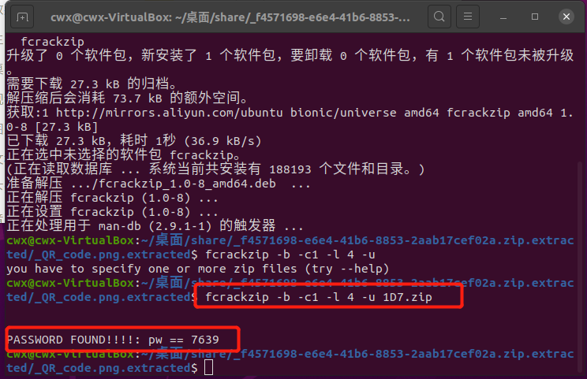
  
- 输入密码解压后，获取flag
  
  ```bash
  CTF{vjpw_wnoei}
  ```
  
    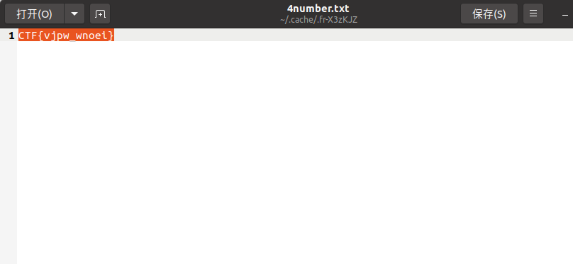
  
  
  
  
  

## [N种解决方法](https://buuoj.cn/challenges#N%E7%A7%8D%E6%96%B9%E6%B3%95%E8%A7%A3%E5%86%B3)

- 原始文件是一个压缩包，同理，使用`binwalk`提取试试，提出来一个`KEY.exe`

  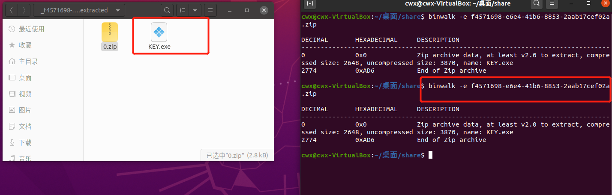

- 使用`winhex`查看`KEY.exe`，发现是jpg文件，且已经经过`base64`加密

  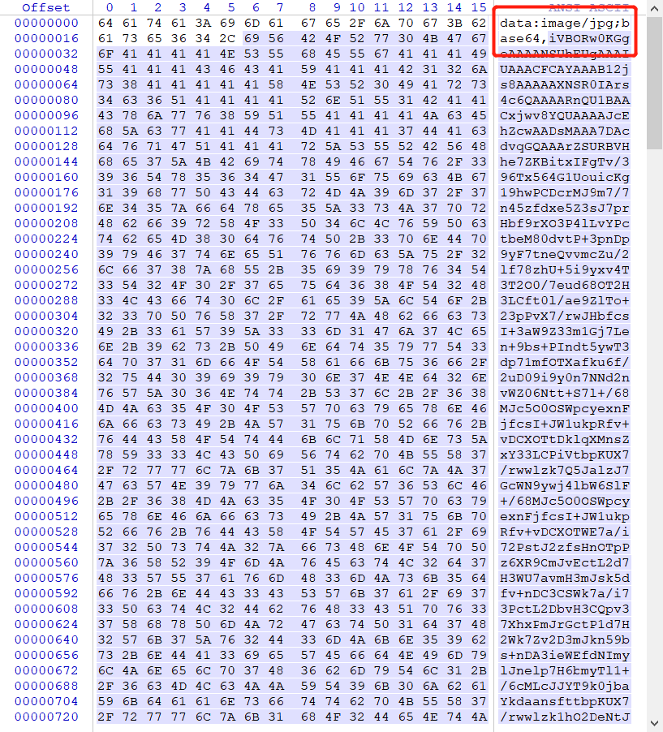

- 接着将内容进行`base64`[解码](https://the-x.cn/base64/)，并存为jpg格式

  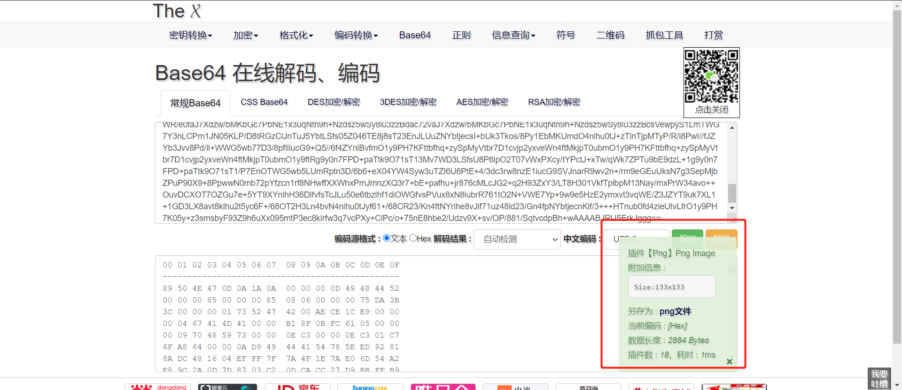

  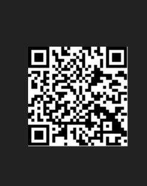

- 生成了一个二维码，第一反应就是扫一扫，结果就有惊喜，就得到了flag，提交的时候把`key`转为`flag`即可

  ```bash
  KEY{dca57f966e4e4e31fd5b15417da63269}
  ```

  

​    

​    

## [SUCTF2018]single [dog](https://buuoj.cn/challenges#[SUCTF2018]single%20dog)

- 题目是`attachment.jpg`，使用`winhex`看发现没什么异常，接着使用`binwalk`提取一下，提取出了一个1.txt

  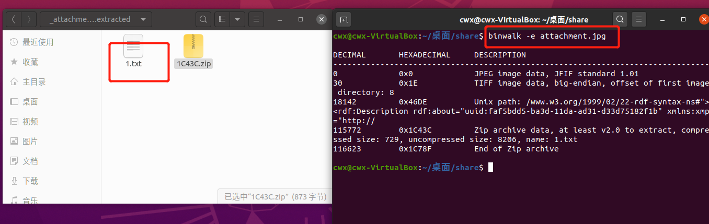

- 查看这个文档，全是颜文字，在网上查询后发现颜文字也可以做加解密，`aaencode`是一个常见的颜文字解密工具

  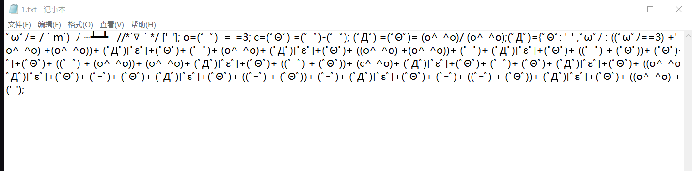

- 解密后得到结果

  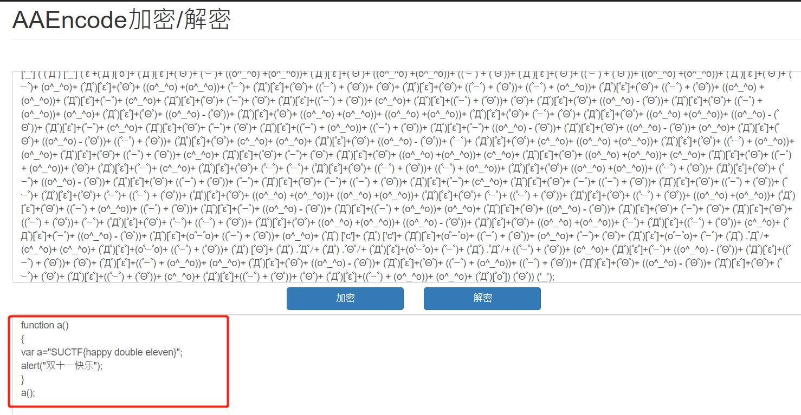

- flag如下，同理前缀改为flag

  ```bash
  SUCTF{happy double eleven}
  ```
  
  