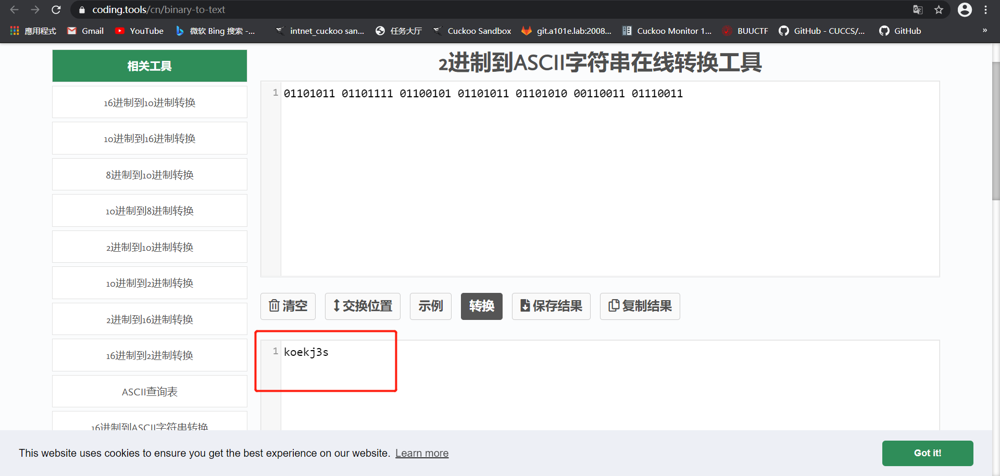
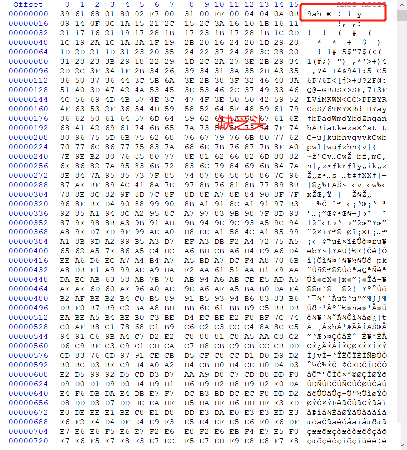
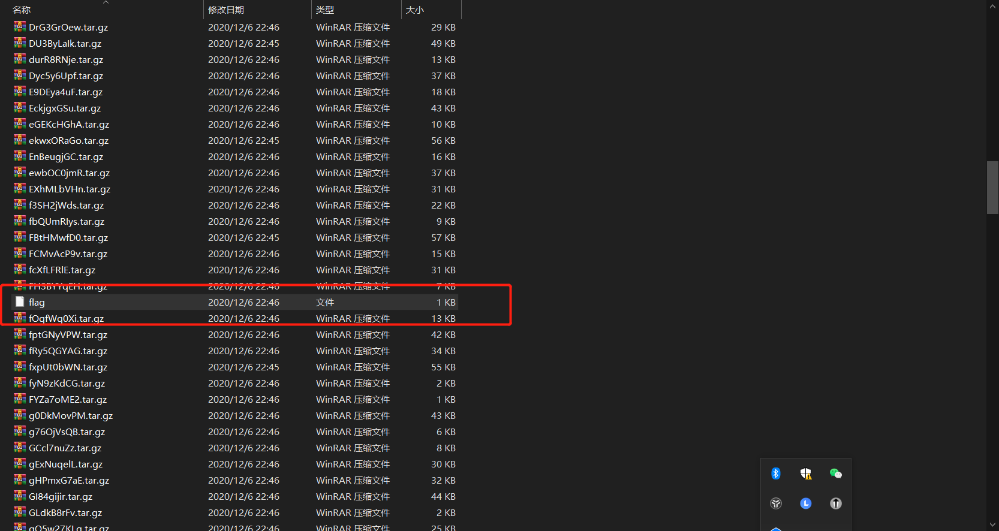

# MISC解题（二）

## [LSB](https://buuoj.cn/challenges#LSB)

- 题目是一个压缩包，下载下来后解压，发现是一张`png`

- 由于题目叫LSB，猜思路应该与LSB有关，用[Stegsolve.jar](http://www.caesum.com/handbook/Stegsolve.jar) `在java环境运行`查看图片

  ```java
  java -jar Stegsolve.jar
  ```

  

- 提取出来存为图片，发现是一张二维码

  

- 扫描二维码，发现`flag`

  ```bash
  cumtctf{1sb_i4_s0_Ea4y}
  ```


## [wireshark](https://buuoj.cn/challenges#wireshark)

- 题目是一个压缩包，发现是`pcap`文件，使用`wireshark`打开

- 进行过滤筛选，最后定位到了一个`post`包，内容中包含`flag`

  

- 这题可能就是单纯的用一下`wireshark`


## [来题中等的吧](https://buuoj.cn/challenges#[HBNIS2018]%E6%9D%A5%E9%A2%98%E4%B8%AD%E7%AD%89%E7%9A%84%E5%90%A7)

- 题目又是一个压缩包，解压后打开是一张png

  

- 根据上课的示例，猜测它是摩斯密码，使用[在线解密工具](https://www.matools.com/morse)，以及摩斯密码的规则，进行解密

  
  
- 得到`flag`，一开始直接复制还不行，发现居然要变为小写
  
  ```bash
  flag{alphalab}
  ```
  
  
  
  
  
  

## [另外一个世界](https://buuoj.cn/challenges#%E5%8F%A6%E5%A4%96%E4%B8%80%E4%B8%AA%E4%B8%96%E7%95%8C)

- 题目是一个压缩包，解压后发现是一张`jpg`

- 使用`stegsolve`多种方式打开都没发现什么特别的

- 使用`winhex`看看原始内容吧，惊奇的发现最后有一大串`01`串

  

- 然后转换为`ASCII`码，得到结果

  

- `flag`如下
  
  ```bash
  flag{koekj3s}
  ```
  
  
  
  
  

## [鸡你太美](https://buuoj.cn/challenges#[BJDCTF2020]%E9%B8%A1%E4%BD%A0%E5%A4%AA%E7%BE%8E)

- 题目是一个压缩包，居然是两个`gif`，一个是可以打开的，一个是无法打开的

  

- 把另一个`gif`的头加到这个`gif`图中，然后在图中就发现了`flag`

  

## [TARGZ-y1ng](https://buuoj.cn/challenges#[BJDCTF%202nd]TARGZ-y1ng)

- 用`linux`下`file`命令可以看到这是个`zip`文件，将后缀改为`zip`，解压时发现需要密码

  

- 使用`hW1ES89jF`当做解压密码发现能成功解密，然后发现又是一个压缩包，继续改后缀，使用文件名继续能解密，以此类推，最后得到`flag`，以下是自动化解压代码

  ```python
  import zipfile
  import os
  
  name = 'hW1ES89jF'
  tmp="hW1ES89jF.tar.gz" #解压过的文件
  while True:
      fz = zipfile.ZipFile(name + '.tar.gz', 'r')
      fz.extractall(pwd=bytes(name, 'utf-8'))
      tmp=name+".tar.gz"
      #os.remove(tmp)
      name = fz.filelist[0].filename[0:9]
      fz.close()
  ```
  
- 得到一堆压缩文件和一个`flag`，打开得到`flag`
  
  
  
  ```bash
  flag{wow_you_can_rea11y_dance}
  ```
  

## [gakki](https://buuoj.cn/challenges#[GXYCTF2019]gakki)

- 压缩包中是一张`jpg`，用`winhex`打开看了无果，使用`binwalk`提取发现一个新的压缩文件`218E8.rar`

  

- 发现解压需要密码，下载一个[Advanced Archive Password Recovery](https://ww.lanzous.com/icug02f)进行暴力破解，得出密码：8864

  

- 得到一个`flag.txt`，打开发现是一堆乱码，这下把我难到了，然后看了网上的经验帖说要统计词频

  

- 于是仿照网上的资料写了一段代码

  ```python
  alphabet = "abcdefghijklmnopqrstuvwxyzABCDEFGHIJKLMNOPQRSTUVWXYZ1234567890!@#$%^&*()_+- ={}[]"
  f = open("flag.txt", "r")
  data = f.read()
  result = {d:0 for d in alphabet}
   
  def sort_by_value(d):
      items = d.items()
      backitems = [[v[1],v[0]] for v in items]
      backitems.sort(reverse=True)
      return [ backitems[i][1] for i in range(0,len(backitems))]
   
  for d in data:
      for alpha in alphabet:
          if d == alpha:
              result[alpha] = result[alpha] + 1
   
  print(sort_by_value(result))
  ```
  
- 最终得到结果
  
  
  
- `flag`为
  
  ```bash
  flag{gaki_IsMyw1fe}
  ```
  
  
  

## [镜子里面的世界](https://buuoj.cn/challenges#%E9%95%9C%E5%AD%90%E9%87%8C%E9%9D%A2%E7%9A%84%E4%B8%96%E7%95%8C)

- 打开压缩包，是一张`png`，且取名为`steg`，猜测是与隐写有关，同样用`stegsolve`打开，且图片上说近距离看，考虑是不是要低比特位

  

- flag为

  ```bash
  flag{st3g0_saurus_wr3cks}
  ```
  
  
  
  