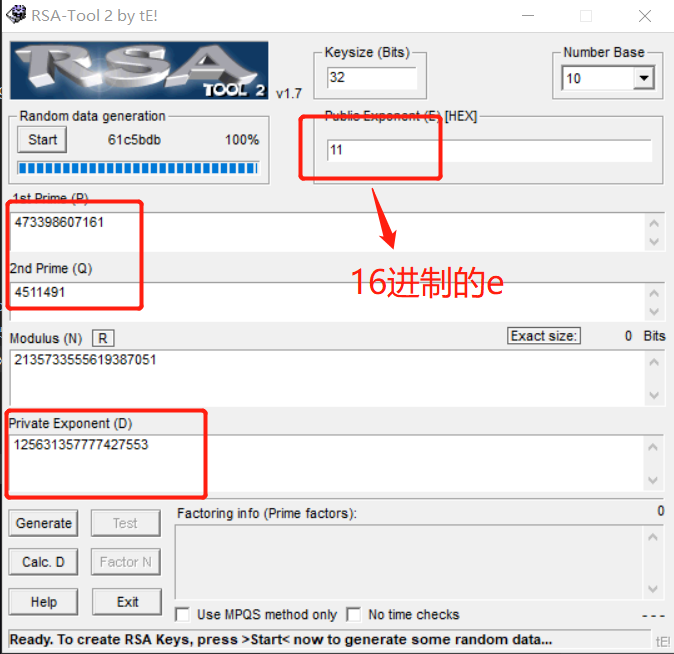
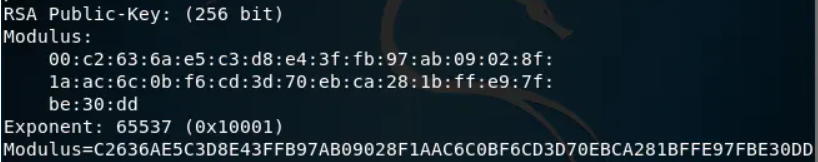
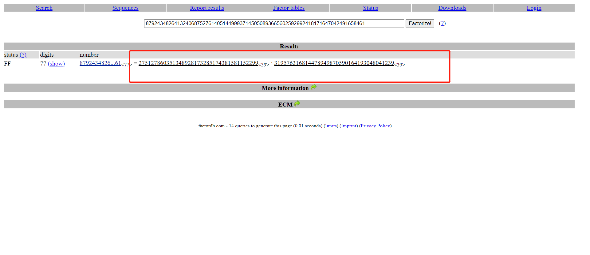
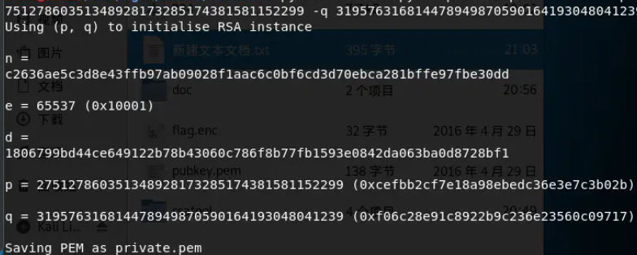
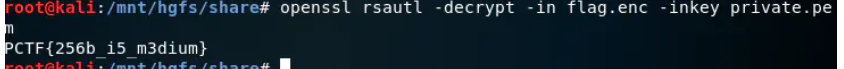
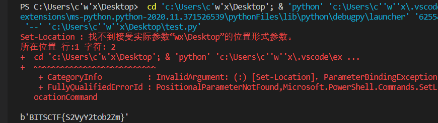
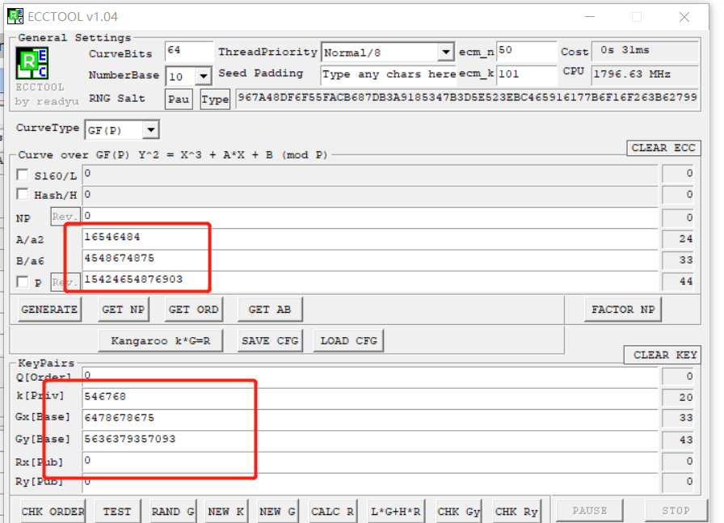

# Crypto 解题writeup

- 平台：[xctf](https://adworld.xctf.org.cn/) 

## [easy_RSA](https://adworld.xctf.org.cn/task/answer?type=crypto&number=5&grade=0&id=5114&page=1)

- 题目是在一次RSA密钥对生成中，假设p=473398607161，q=4511491，e=17,求解出d

- 能用工具实现绝不写代码hhh，使用RSA-Tool 2 by tE

  > https://pan.baidu.com/s/182ckXcTZ9XhgiShT0XAV_w
  >
  > 提取：punf

  

- 最终得到`d`，也就是`flag`

  ```bash
  cyberpeace{125631357777427553}
  ```

## [Normal_RSA](https://adworld.xctf.org.cn/task/answer?type=crypto&number=5&grade=0&id=5115&page=1)

- 题目为一个压缩包，包中有两个文件，猜测是openssl加密有关

- 将压缩包放到虚拟机中，使用`openssl`解密公钥的参数

  ```bash
  openssl rsa -pubin -text -modulus -in pubkey.pem
  ```

- 得到e为65537，大整数：c2636ae5c3d8e43ffb97ab09028f1aac6c0bf6cd3d70ebca281bffe97fbe30dd

  

- 转为十进制得到：87924348264132406875276140514499937145050893665602592992418171647042491658461

- 对该大整数进行[分解]([http://www.factordb.com/](https://links.jianshu.com/go?to=http%3A%2F%2Fwww.factordb.com%2F))得到`p`和`q`

  
  
- 用rsatool生成私钥文件: private.pem
  
  ```bash
  python rsatool.py -o private.pem -e XXX -p XXX-q XXX
  ```
  
  

- 用private.pem解密flag.enc得到`flag`

  ```bash
  openssl rsautl -decrypt -in flag.enc -inkey private.pem
  ```

  

- `flag`为

  ```bash
  PCTF{256b_i5_m3dium}
  ```

## [幂数加密](https://adworld.xctf.org.cn/task/answer?type=crypto&number=5&grade=0&id=5120&page=1)

- 题目为一个`txt`，是一串数字`8842101220480224404014224202480122`

- 先学习了一下幂数加密，发现这串数字可以进行分割（说实话，脑洞很大，参考了[别人](https://blog.csdn.net/weixin_43990313/article/details/100803235)的`writeup`才做出来的，将数字相加得到23 5 12 12 4 15 14 5，对应字母表顺序就是`welldone`，这好像叫云影密码

  

- `flag`为

  ```bash
  cyberpeace{WELLDONE}
  ```

## [fanfie](https://adworld.xctf.org.cn/task/answer?type=crypto&number=5&grade=1&id=5535&page=1)

- 题目是一串大写英文字母`MZYVMIWLGBL7CIJOGJQVOA3IN5BLYC3NHI`，对字符串BITSCTF进行base32编码得字符串`IJEVIU2DKRDA====`，与文本中的字符串进行对比，发现字符I两次对应M，猜测是移位密码或仿射密码，加密运算的有限集为{A,B,C,D,E,F,G,H,I,J,K,L,M,N,O,P,Q,R,S,T,U,V,W,X,Y,Z,2,3,4,5,6,7},最后发现是仿射密码，求得解密式为x=5y+12 mod 32x=5y+12 mod 32。

- 写了一段代码解题

  ```python
  from base64 import b32decode
  
  def solve():
      s='MZYVMIWLGBL7CIJOGJQVOA3IN5BLYC3NHI'
      dic='ABCDEFGHIJKLMNOPQRSTUVWXYZ234567'
      msg=''.join([dic[(5*dic.find(x)+12)%32] for x in s])
      return b32decode(msg+'='*(8-len(msg)%8))
  
  if __name__=='__main__':
      print (solve())
  ```

  

- 最终得`flag`为`BITSCTF{S2VyY2tob2Zm}`

## [easy_ECC](https://adworld.xctf.org.cn/task/answer?type=crypto&number=5&grade=0&id=5116&page=1)

- 题目很直接，就是ECC的公钥计算

- 还是能用工具就不写代码，使用[ECCTOOL](https://bbs.pediy.com/thread-66683.htm)进行解题

  
  
- 得到`flag`为`cyberpeace{19477226185390}`
  
  