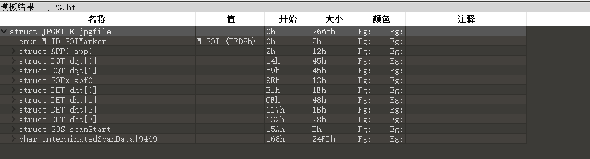
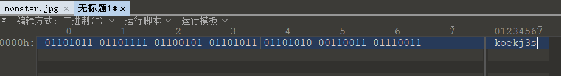
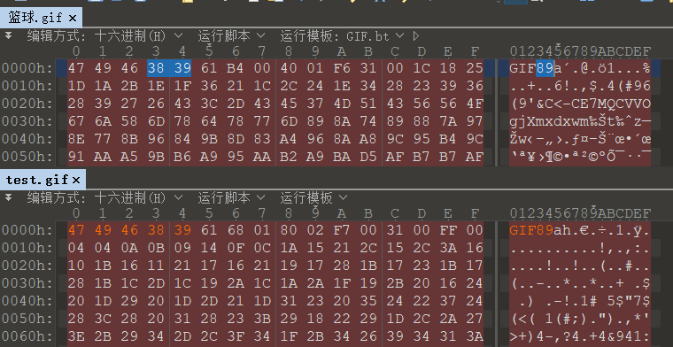
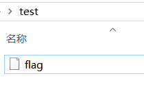

平台：https://buuoj.cn/
1. LSB 

   使用stegslover查看最低位屏幕，另存为二进制文件。还挺明显的，导出数据，是个png图片。

   

2. Wireshark 

   查看http流，看到flag字眼。打开数据包，追踪 tcp 流找到一串password，试一下就是flag。

3. [HBNIS2018]来题中等的吧  

   乍一看时二维码，可是没有那么宽的二维码呀，扫也扫不出来。看下图的绿色条纹，发现有短的和宽的绿条纹，且出现了等距的黑色分隔，因此是一段莫斯电码。对应的摩斯电码为

   ```
   ._  ._.. ._ _. .... ._  ._.. ._  _...
   ```

   

   翻译出来就是

   ```
   flag{ALPHALAB}
   flag{alphalab}
   ```

4. 另外一个世界

   拿到一张 jpeg 图片，binwalk 没有提取出东西，查看文件结构似乎也很正常 /并不知道异常是啥样

   

   查看一下是否有奇怪的字符串
   ```
   string monster.jpg 
   ```

   发现可打印字符有一堆奇妙的 01 值

   ```
   01101011011011110110010101101011011010100011001101110011.
   ```

   以为是进制转换，转了一下发现不对，看这个 01 值还挺有规律的，所以就想转转 ascii，然而并没有在线的工具可以直接用，所以用 010editor 手动写了一下二进制

   

5. [BJDCTF2020]鸡你太美 

   

   

6. TARGZ-y1ng  

   拿到压缩包，发现需要密码才能解压，虽然时 tar.gz 的文件后缀，但是 file 查看文件格式时为 zip 文件格式，题目提示密码不需要爆破，尝试发现密码为文件名，遂写脚本如下，找到flag

   ```bash
   cd test/
   for i in `seq 1 1000`
   do 
     file=$(ls *)
     unzip -P ${file%.*.*} $file
     if [[ ${file##*.} == gz ]];
     then
       rm $file
     else
       break
     fi 
   done
   ```

   

7. [GXYCTF2019]gakki

   ```bash
   apt-get install rarcrack
   # 破解压缩包，4位数字
   # 得到flag是一堆混淆的数据。没做出来，看了wp才发现是个词频统计的题
   ```

8. 0x0F 镜子里的世界

   LSB，在rgb通道的 LSB

