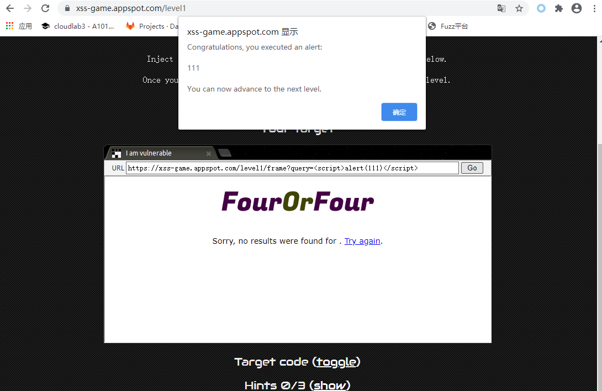
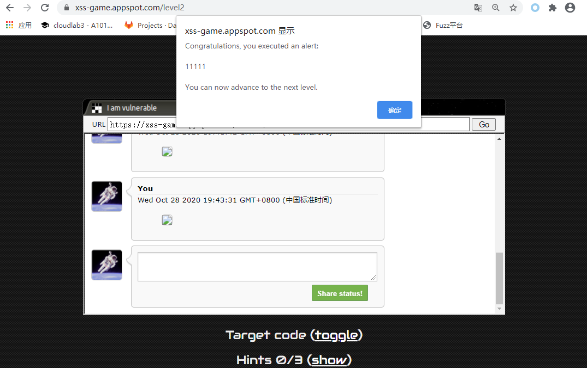
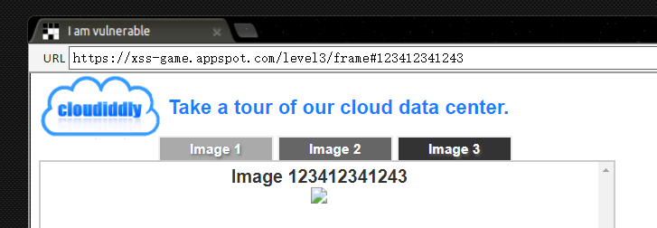
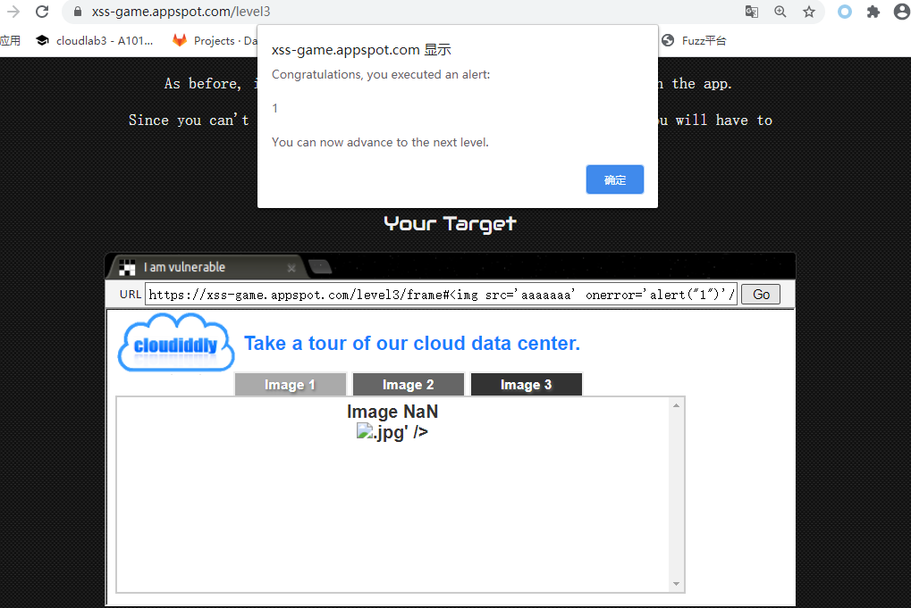

# WEB

## XSS 跨站脚本攻击

题目地址：https://xss-game.appspot.com/level1

```bash
<script>alert(111)</script> 


```

- level 1题目提示可插入 js 代码 alert 弹出消息框。




- level 2:Persistence is key

> No matter where such user-controlled data comes from, it should be handled carefully.


---

```
&lt;script&gt;alert(111)&lt;/script&gt;


This level is sponsored by the letters <i>i</i>, <i>m</i> and 
         <i>g</i> and the attribute <code>onerror</code>.
```



> 一不小心右键源码看见了hint
>

```html

  <div id="hints">
    <ol>
      <li style="display: none" data-hidden="true"><b>1.</b> 
    Note that the "welcome" post contains HTML, which indicates 
         that the template doesn't escape the contents of status messages.
  
    <li style="display: none" data-hidden="true"><b>2.</b> 
    Entering a &lt;script&gt; tag on this level will not work.
         Try an element with a JavaScript attribute instead.
  
    <li style="display: none" data-hidden="true"><b>3.</b> 
    This level is sponsored by the letters <i>i</i>, <i>m</i> and 
         <i>g</i> and the attribute <code>onerror</code>.
         
  
    </ol>
  </div>
```

- level 3

  寻找输入点





## CISCN2019华东北赛区web2

https://buuoj.cn/challenges

题目地址:web类 CISCN2019华东北赛区web2

思路：找到XSS注入点，绕过csp限制，获取管理员的cookie，使用管理员的

cookie登录，sql注入得到fla