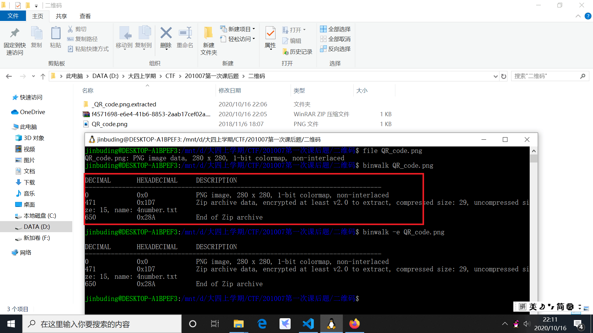
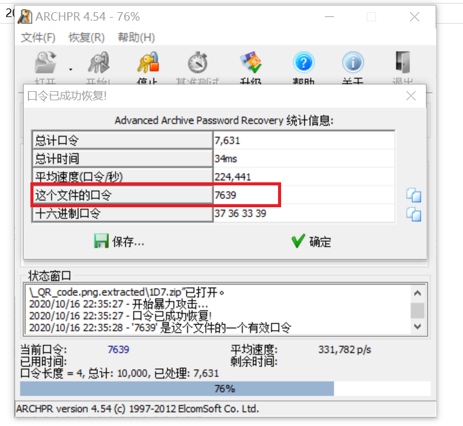
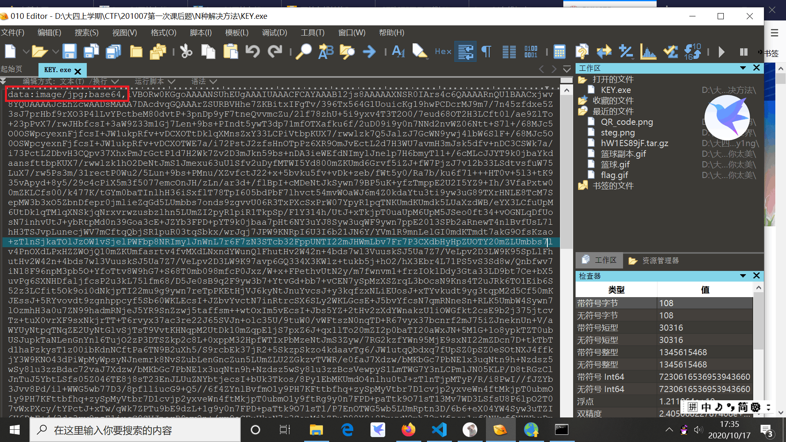
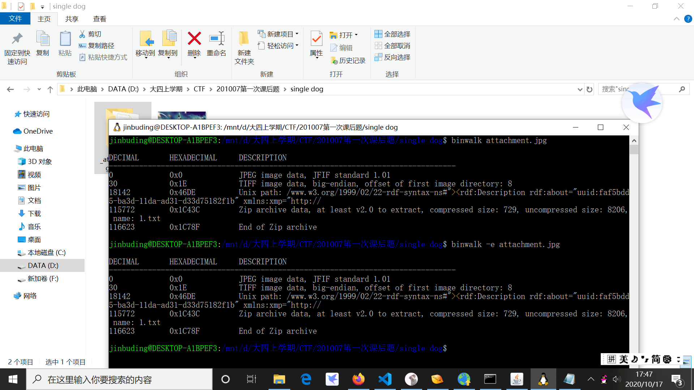
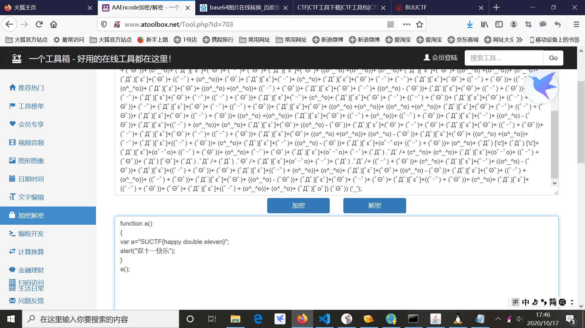

# Writeup

## 1. 二维码

1. 手机扫描二维码后没有得出任何有效信息

2. binwalk命令发现文件中隐藏着别的文件。有压缩包和一个4number.txt

   

3. binwalk -e 命令分离后，发现压缩文件需要密码解压，根据4number猜测是密码为四位数字。放到软件里暴力破解，很快就得出口令为7639

   
   
4. 解压缩后打开txt文件即为flag

## 2. N种解决方法

1. 把解压得到的exe文件用010 editor打开，发现这其实是一个jpg文件，而且用base64编码

   

2. 用[在线工具](http://tool.chinaz.com/tools/imgtobase/)把编码转换为图片

   

   * 找到对应的工具可以事半功倍

## 3. single dog

1. binwalk跑一下发现图片中有隐藏文件

   

2. 打开提取出的文件发现里面有1.txt，全是颜文字。用[在线颜文字解密工具](http://www.atoolbox.net/Tool.php?Id=703)解密即可得到flag

   