# Writeup

## 1. LSB

1. 下载工具[Stegsolve.jar](http://www.caesum.com/handbook/Stegsolve.jar)，用Stegsolve打开压缩包里的图片
2. 提取并保存为flag.png

   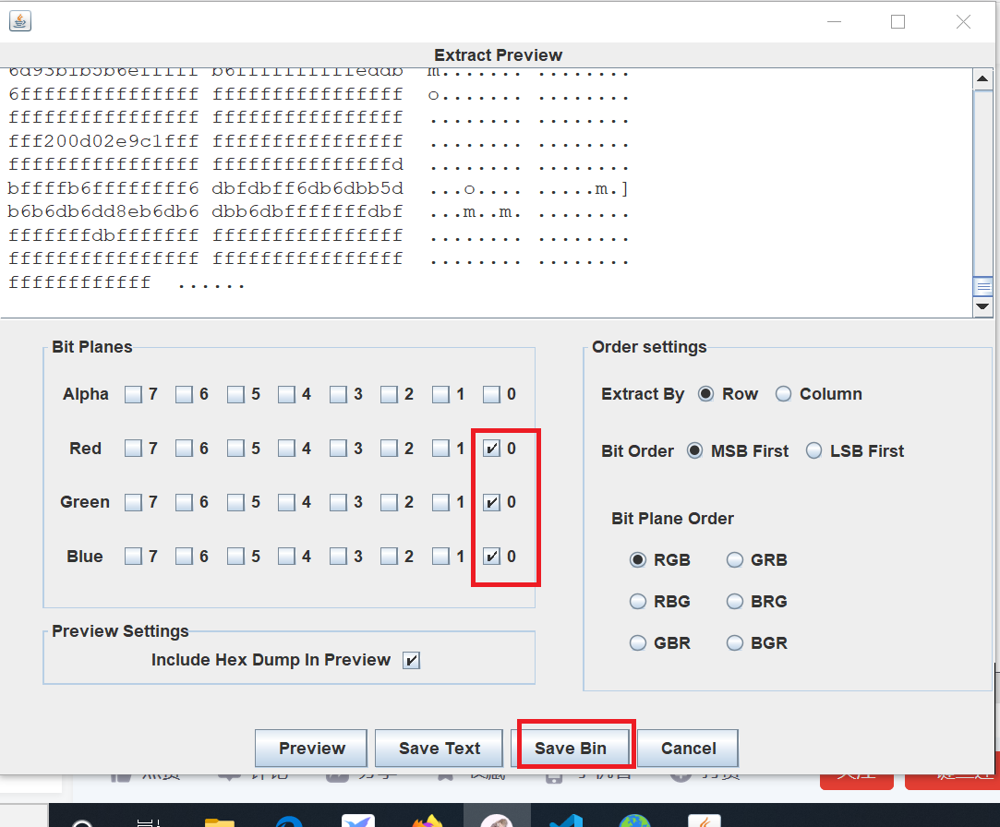

    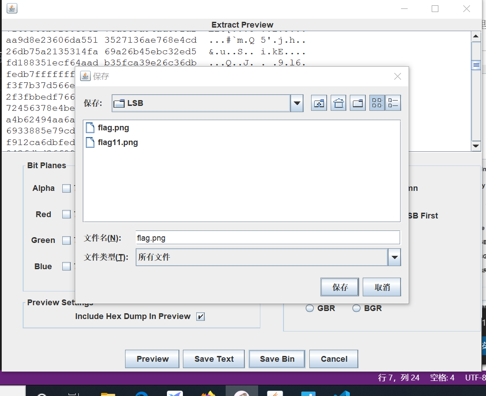

3. 打开flag.png发现是一个二维码，扫描后得到flag

## 2. wireshark

1. 用wireshark打开.pcap文件，过滤出http数据包

2. post中发现是进行用户登录操作，那么用户会输入用户名和密码。看一下数据包详情，找到对应的password字段即可

   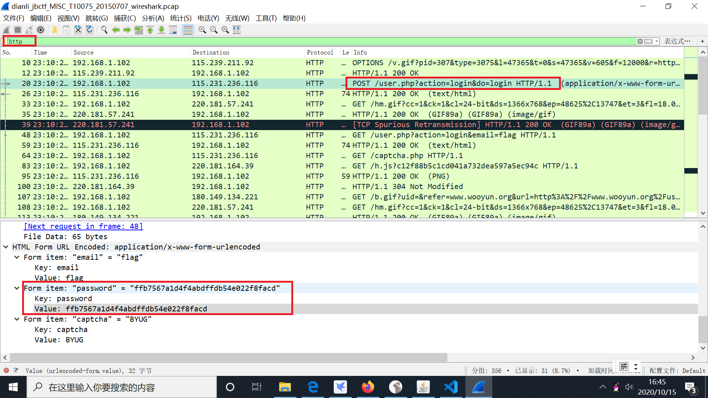

## 3. 来题中等的吧

1. 就是摩斯密码，找一个在线解密的工具，对应图片上的输入并解密即可
  
   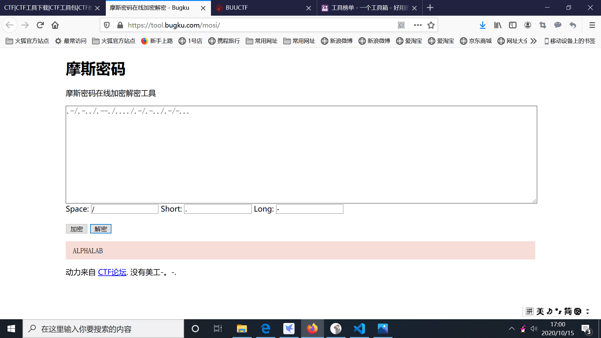

## 4. 另一个世界

1. 下载解压后发现是一个可爱的毛毛头，把它用winhex打开，发现末尾有一串01字符串

   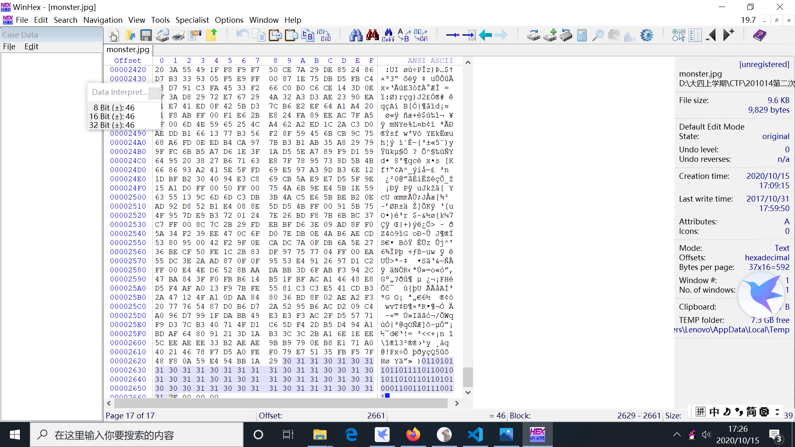

2. 用在线ascii编解码器进行转换即可

   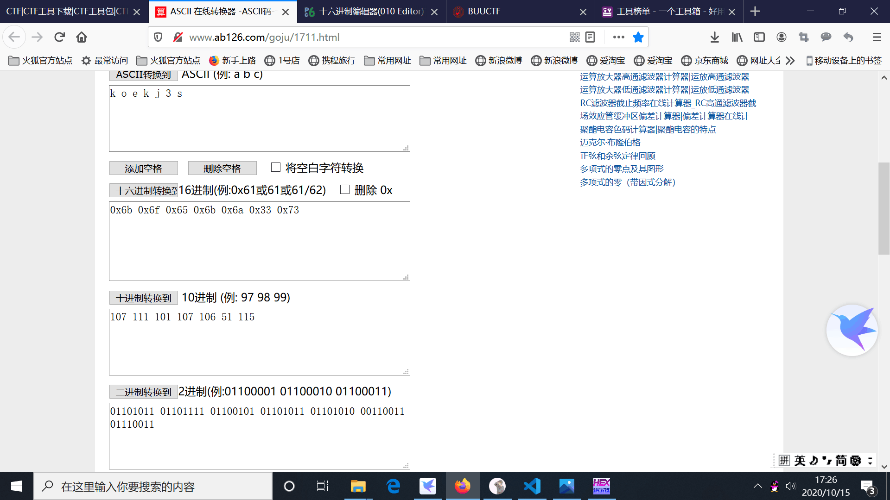

## 5. 鸡你太美

1. 解压后发现有两个gif图片，一个可以显示，一个不可以。用十六进制编辑器打开，发现篮球.gif有gif头，而篮球副本.gif没有。

   

   

2. 给没有gif头的文件最前面插入gif头，即插入四字节十六进制"47 49 46 38"

   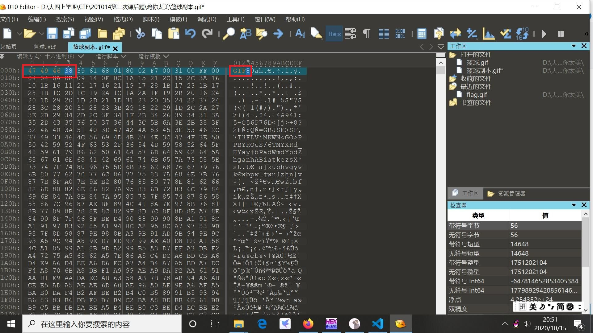

3. 将插入后的文件保存为flag.gif，打开即可看到图片上的flag。尝试用winhex保存，但是可能是版本问题不能保存，换成010 editor之后发现更好用

    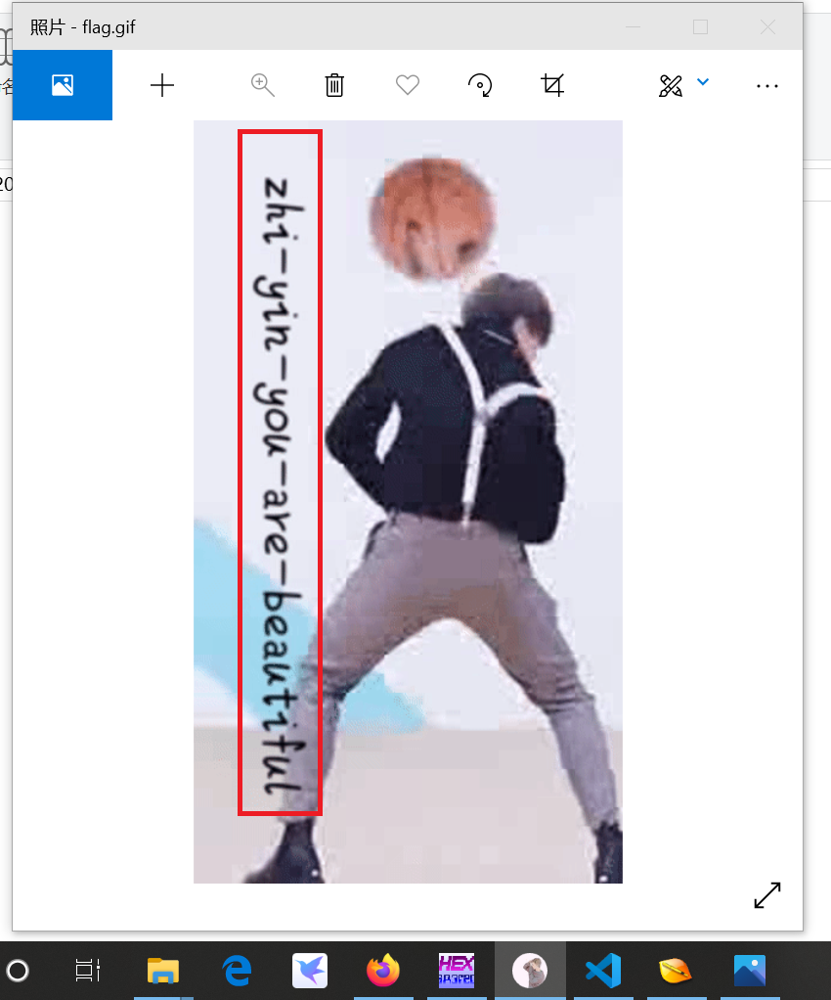
   
## 6. TARGZ-y1ng

1. 用file命令发现这其实是一个zip文件

   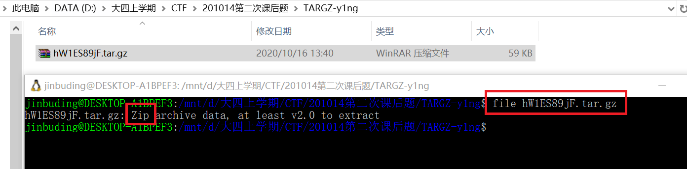

2. 修改压缩包后缀为zip，并用压缩包名作为密码，发现可以解密，但解密出来仍为一个以.tar.gz为后缀的文件。用file命令发现这个文件仍为zip文件。如此反复几次出现了很多文件，但依旧没有flag，尝试用脚本自动化解压缩。

   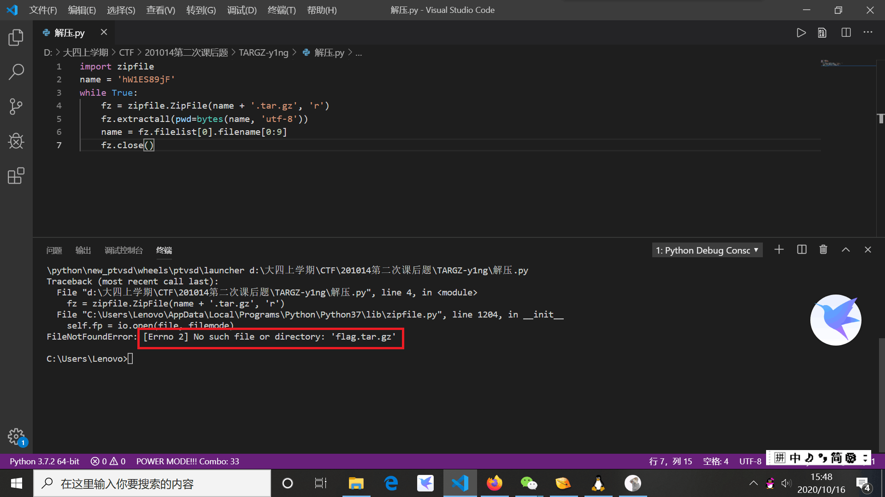

3. 出现flag文件，添加.txt后缀，打开即可得到flag

   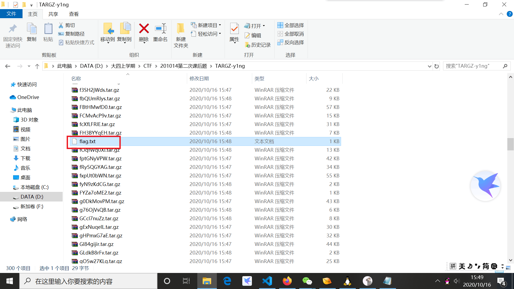

## 7. gakki

1. binwalk跑一下发现图片里面隐藏着别的文件

   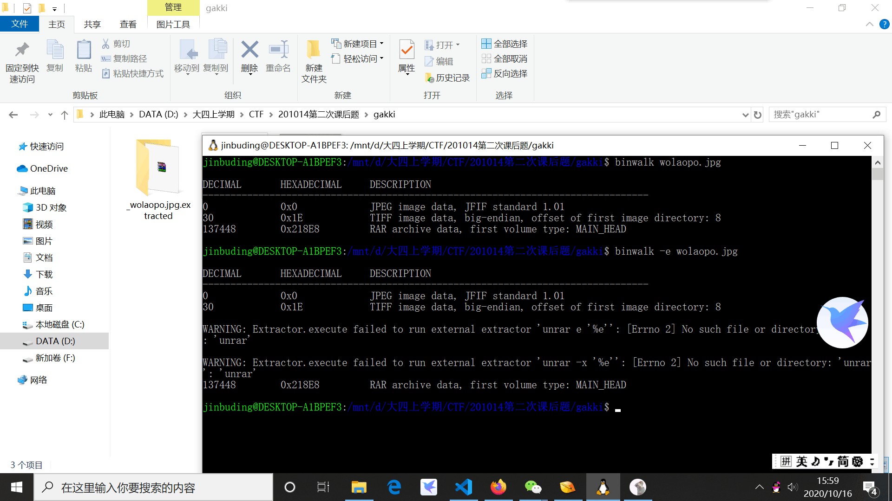

2. 尝试解压，发现需要密码。下载一个暴力破解密码软件[Advanced Archive Password Recovery](https://ww.lanzous.com/icug02f)，进行暴力破解。经过漫长的破解后得出密码：8864

   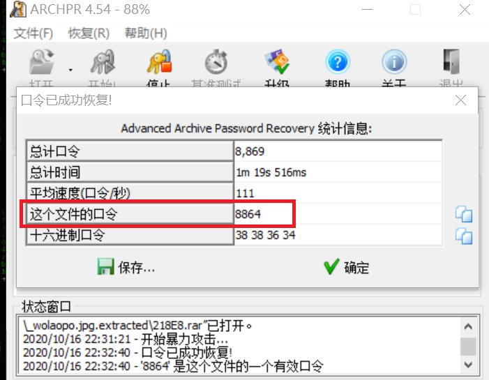

3. 用密码解压缩文件后出现flag.txt，打开是一堆乱码，各种尝试解码后无果。其实是要词频统计

   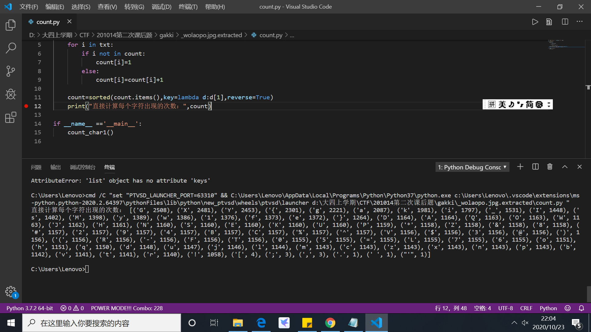

## 8.镜子里面的世界

用Stegsolve打开压缩包里的图片，发现flag

   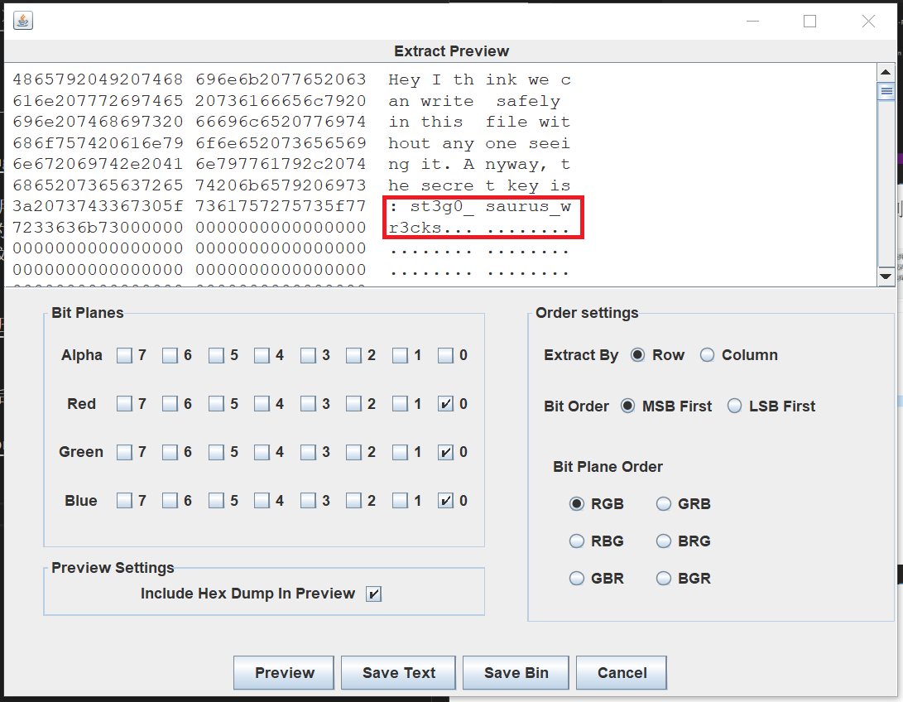
