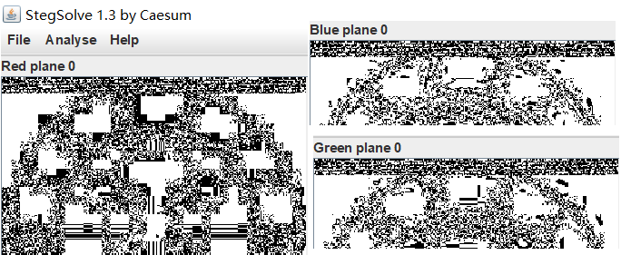
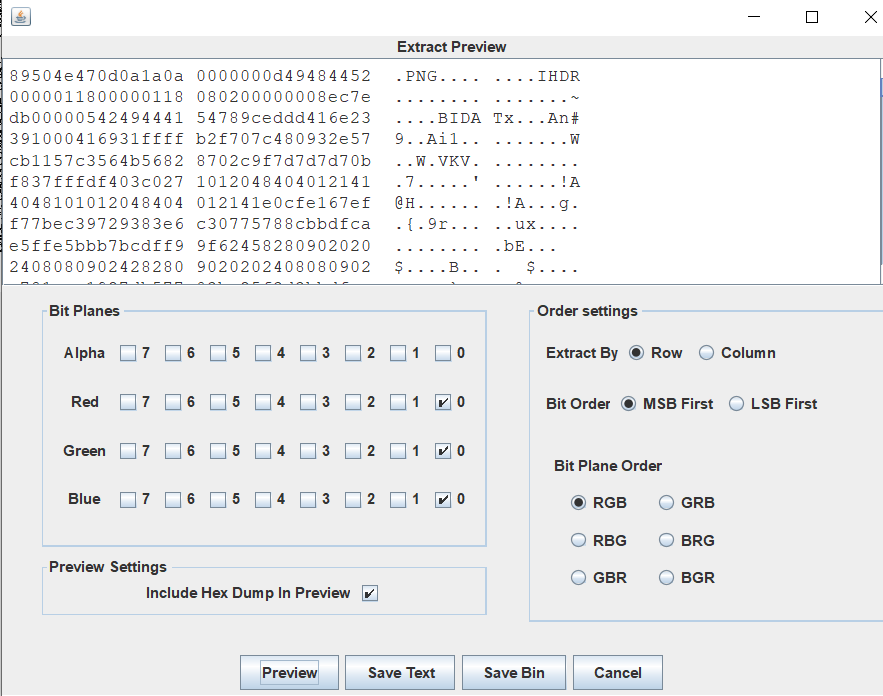
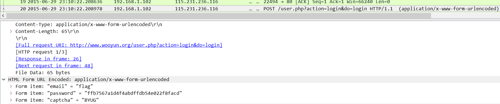
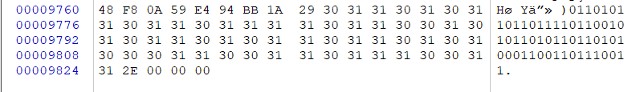
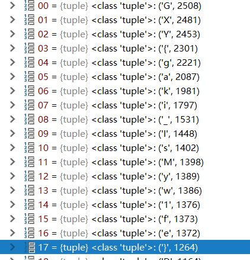
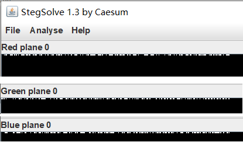
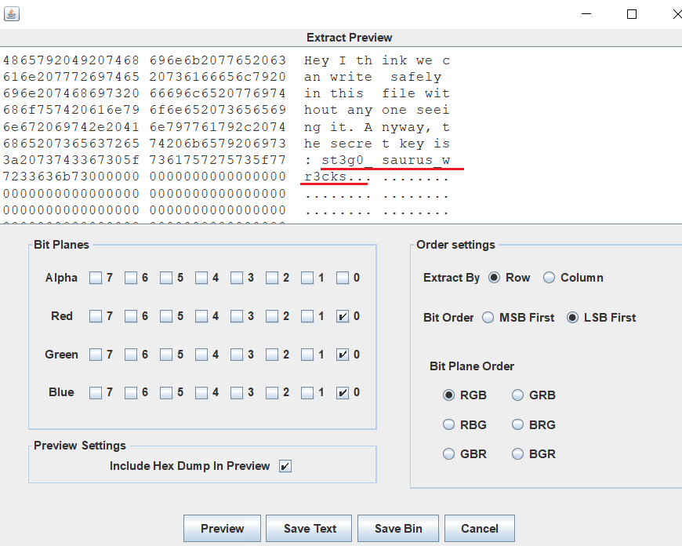

#  Writeup

## LSB

- Stegsolve.jar 查看图片，发现 Red、Blue、Green  三个通道的第 0 层左上角都有疑似隐写内容

  
  
- 使用  Stegsolve.jar 进一步进行分析，提取图层，发现新的 PNG 图片，将其导出，是一个二维码，扫描得 flag
    
    

## Wireshark 

- 使用 wireshark 打开数据包，找到 login post数据包

  

## [HBNIS2018]来题中等的吧  

- 查看题目的图片，像是摩斯密码，对照摩斯密码表拿到 flag

## 另外一个世界

- 使用 winhex 打开图片，发现最末尾是 0 1 构成的字符串，将字符串 8 个字符为一串进行二进制转 ascii 码，得到 flag

  

## [BJDCTF2020]鸡你太美 

- 题目中给了两个 .gif 文件，其中一个可正常打开，另一个不能，打开副本文件，发现文件头缺少GIF8，使用 notepad++ 修改保存就能正常的 gif 图片打开，打开后得到 flag

## TARGZ-y1ng  

- 尝试使用文件名作为压缩密码解压成功，发现是嵌套压缩，使用脚本进行解压，最后得到 flag 文件

  ```python
  import os
  import zipfile
  from os.path import join, getsize
  
  def zip_file(zip_name):
      fz = zipfile.ZipFile(zip_name,'r')
      passwd='hW1ES89jF'
      while(fz):
          for file in fz.namelist():
              tmp = os.path.splitext(file)
              tmp1 = os.path.splitext(tmp[0])
              fz.extract(file,pwd=passwd.encode('ascii'))
              passwd = tmp1[0]
              if tmp[1]=='.gz' or tmp[1]=='.zip':
                  zip_name=tmp1[0]+'.zip'
                  os.rename(file,zip_name)
                  fz = zipfile.ZipFile(zip_name,'r')
              else:
                  return
          
  
  zip_file("hW1ES89jF.zip")
  ```

  

## [GXYCTF2019]gakki

- 使用 winhex 打开文件，发现文件中包含 flag.txt 字符，进一步分析发现 图片中隐藏了 Rar 文件，将 Rar 之前的字段删除，而后得到 rar 文件。

- 得到 rar 文件之后解压需要密码，使用 RAR Password Crack 爆破密码，得到一个 flag.txt , flag .txt 中全是可打印字符，但是无法直接搜索得flag，将其进行字符统计得 flag

  ```python
  import os
  with open("flag.txt") as f:
      data = f.read()
  my_dict={}
  for i in data:
      if i in my_dict:
          my_dict[i]+=1
      else:
          my_dict[i]=1
  a = sorted(my_dict.items(),key=lambda x:x[1],reverse=True)
  ```

  

  

## 0x0F 镜子里的世界

- 首先使用```Stegsolve.jar```查看图片，发现 Red、Blue、Green  三个通道的第 0 层左上角都有疑似隐写内容

  

- 使用 ```Stegsolve.jar``` 进一步进行分析，提取图层，发现 flag

  

  

  

  

  

  
  
  
  
  
  
  
  
  

