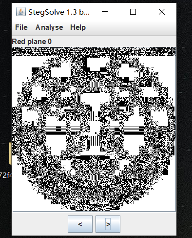
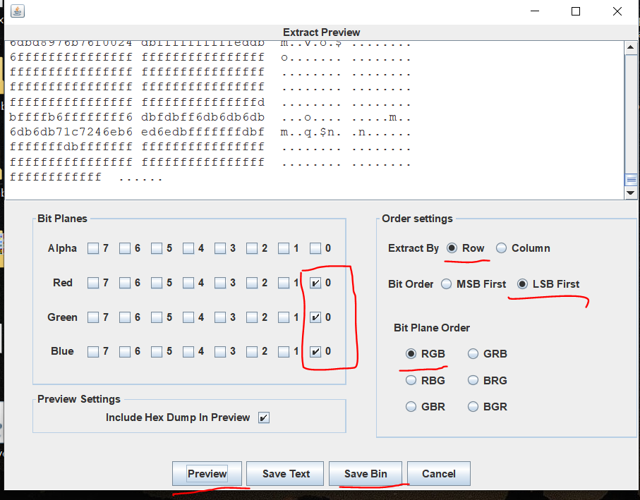
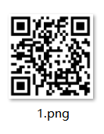

##  1. LSB 

该题目为在图片 RGB 通道进行 LSB 隐写，使用 Stegsolve 进行观察可以发现异常。

使用 Stegsolve  的 data extract 导出二进制数据包

拿到 flag 对应的二维码

## 2. Wireshark

使用 wireshark 打开 pcap数据包，使用 http contains "password"抓取关键字，拿到 password ,就是 flag.

## 3.[HBNIS2018]来题中等的吧 

本题为 摩斯码，宽线为 -  短线为 .   每个摩斯码对应一个字母，对应翻译以后得到flag   ，ALPHALAD ,大写提交报错，需要提交小写格式字母。

使用二进制 flexhex ，发现有一段 0 和 1 的字符串。八个一组，转为 ASCII 码对应的字母。

## 5.[BJDCTF2020]鸡你太美 

本题有两个图片一个副本文件，是错误的 gif 格式，和正常的 gif 格式相比，缺少 GIF8 ，使用 notepad ++  修改以后保存，即可打开，gif 中显示的就是 flag ，注意提交的时候需要将 flag 中 -  替换为下划线   _   。

##  6. TARGZ-y1ng  

对应的密码就是文件名。但是嵌套压缩，需要使用脚本解压.

