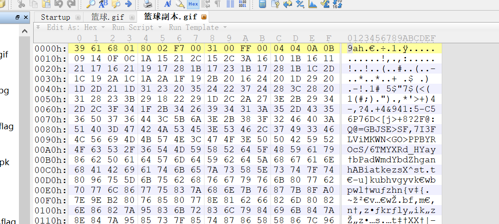

# 1.LSB 
打开附件，发现是一张图片

因为题目已经提示是lsb，我们尝试一下lsb隐写

先打开stegsolve，把每个通道都看了一遍，发现rgb的0通道好像有二维码的模样


我们用data extract功能来提取下信息


rgb三个通道选择0，bit顺序选择lsb优先

预览一下我们可以看到这是一个png图片

保存二进制形式，后缀改为png


我们可以得到二维码（已打码）


# 2. wireshark

题目给出提示：管理员的密码即是答案

我们需要知道，在网络中一些不希望别人看到的信息会通过post方式传送，因为post不会进行明文传输

那么接下来我们筛选出来用post方式传输的信息

`http.request.method==POST`


只有一条信息


右键http追踪流

我们可以看到密码


# 3.来题中等的吧 

只有粗细不等的竖线，我们尝试摩斯密码

细线是点，粗线是横

解密后得到flag

# 4.另外一个世界

用16进制编辑器打开后检查最后的二进制

发现有二进制

二进制转十进制

# 5. [BJDCTF2020]鸡你太美 

文件中是两个gif图片

一个可以打开，另一个不能打开

我们查看两个图片的十六进制文件，发现那个不能打开的文件缺少gif文件头，我们补全它，就可以看到了

`47 49 46 38`




然后使用ps逐个查看图层，发现flag

# 6. TARGZ-y1ng

打开压缩包，我们发现压缩包中的文件被加密了
提示不需要爆破，我们看名字比较奇怪，尝试一下，发现前一个压缩包的名字是后一个压缩包的密码，那我们需要一个脚本进行爆破

```#!/usr/bin/python

import zipfile
name = 'OKMIlLVft'
while True:
    fz = zipfile.ZipFile(name+'.tar.gz', 'r')
    fz.extractall(pwd=bytes(name))
    name = fz.filelist[0].filename[0:9]
    print ("filename:" + name)
    fz.close()
```

# 7. [GXYCTF2019]gakki

我们在kali中使用foremost命令分离出一个压缩包

爆破密码得到一个txt文件

里面是奇怪的字符

我们尝试一下词频统计

```
alphabet = "abcdefghijklmnopqrstuvwxyzABCDEFGHIJKLMNOPQRSTUVWXYZ1234567890!@#$%^&*()_+- ={}[]"
f = open("你文件的位置", "r")
data = f.read()
result = {d:0 for d in alphabet}
 
def sort_by_value(d):
    items = d.items()
    backitems = [[v[1],v[0]] for v in items]
    backitems.sort(reverse=True)
    return [ backitems[i][1] for i in range(0,len(backitems))]
 
for d in data:
    for alpha in alphabet:
        if d == alpha:
            result[alpha] = result[alpha] + 1
 
print(sort_by_value(result))
```

# 8. 镜子里面的世界

打开压缩包，图片标题是steg

我们尝试一下隐写，，这里介绍一个隐写工具zsteg

在kali里面执行

`zsteg steg.png`

可以得到内容


