# cuc-ctf
中国传媒大学 CTF 竞赛组织

本仓库用户收集 2020 秋季 CTF 线下培训课后题的 writeup，请同学们按照以下要求提交：

- fork 本仓库。
- 在 `writeups/` 文件夹下，以个人的 ID 建立一个自己的文件夹，个人的 writeup 都存储在自己的文件夹下。
-  向主仓库发送 `PR`。

例：同学 apple 在  `writeups/` 目录下建立了自己的文件夹  `writeups/apple` ，则他个人仓库下的文件目录大致如下：

```
└─ 2020_Autumn
    └─ writeups
        └─ apple
            |─ writeup1.md
            |─ writeup2.md
            └─ writeup3.md
```

## ctf writeup 提交步骤

### Prerequest

- 自己注册一个 github 账号；
- 在本地安装一个 github 命令行工具，此处推荐 git bash；
  - 推荐配置本地 ssh 密钥访问 github。

###  提交 writeup 步骤

#### fork 仓库

首先在浏览器上登录 github 账号，然后访问 [cuc-ctf writeup 网址](https://github.com/CUCCS/cuc-ctf) ，点击仓库首页右上角 fork , 从本仓库 fork 一个仓库到自己的 github 账号上。

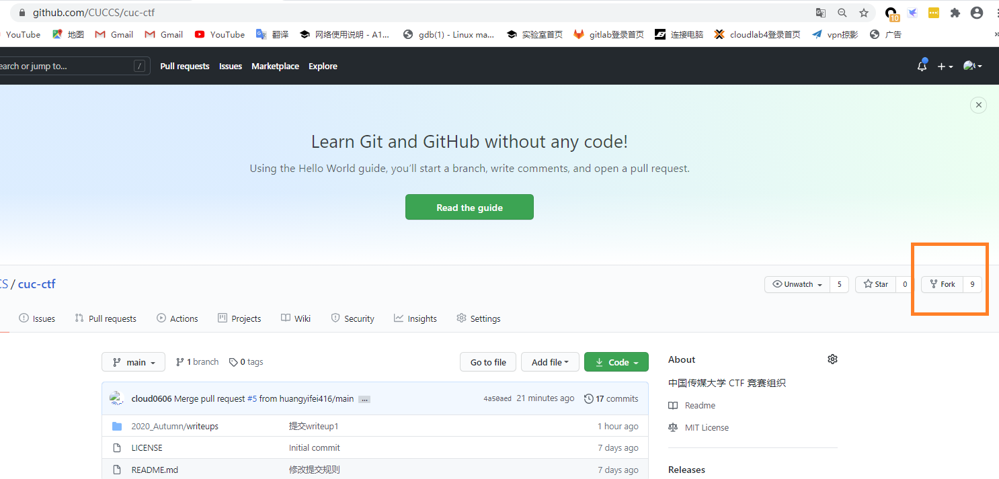

点击选择自己的用户名，等待一会，fork 就完成了。

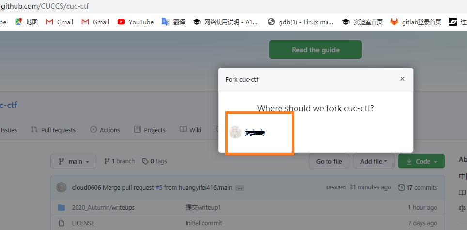

此时可以在自己的 github 上查看到 fork 的仓库。

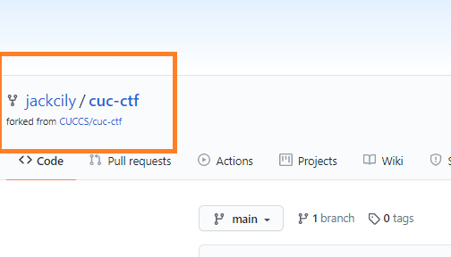

#### 提交 writeup

在自己的电脑上右键选择 `Git Bash Here`，打开一个 bash 命令行，输入指令：

```bash
git clone fork的仓库地址
```

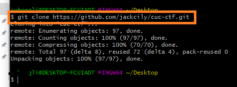

`fork 的仓库地址`就在浏览器端自己 fork 下来的仓库首页就能找到。

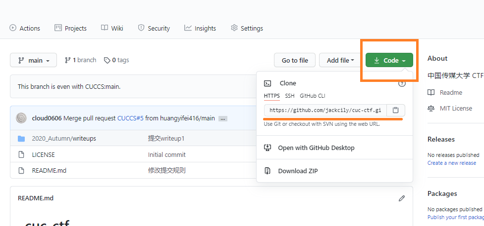

此时在命令行中输入以下指令进入 fork 的仓库。

```bash
# 查看克隆下来的仓库
ls |grep cuc
#进入仓库
cd cuc-ctf/
```

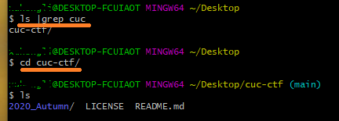

我们在对应路径下找到拉取下的仓库文件夹，在 `2020_Autumn\writeups` 文件夹下新建一个自己的文件夹，然后把自己的writeup放进去。

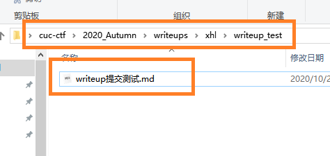

回到 git bash 的命令行窗口，输入以下指令提交修改到自己的仓库。

```bash
#查看本地文件变更状态
git status

#提交修改到自己的远程仓库
git add 修改的文件或文件夹
git commit -m "本次提交的注释"
git push origin main
```
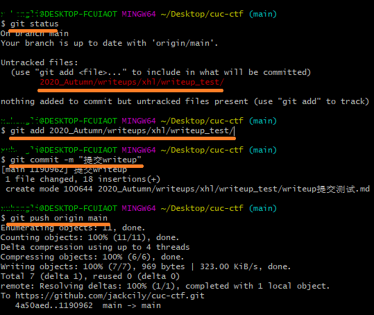

回到浏览器界面查看到本地文件已经被提交到了自己的远程仓库，点击右上角` Pull request`  向 `CUCCS/cuc-ctf `仓库发起 PR 请求。

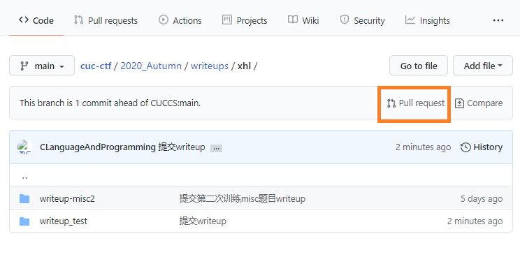

点击 Create pull request, 跳转到输入提交注释框，再次点击 Create pull request,成功创建一次 PR。


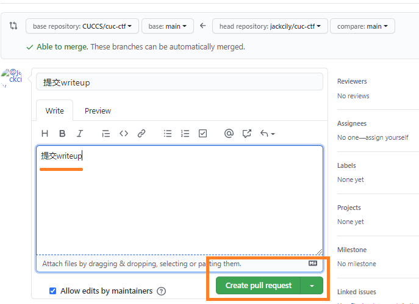

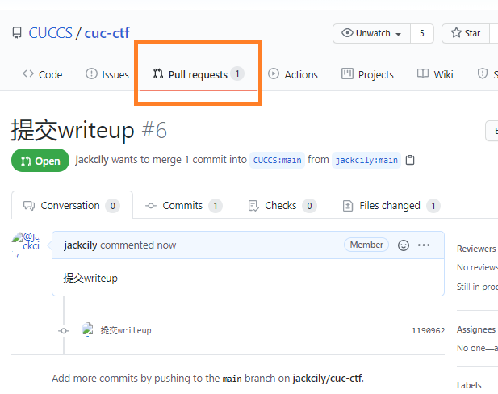
